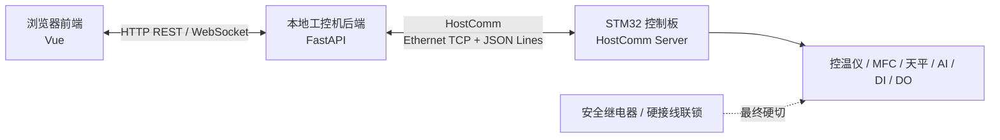

# GB/T 34211 熔滴炉 HostComm 上位机通信协议开发需求说明

版本：V0.1
日期：2026-06-09
适用对象：STM32 控制板供应商、Web 上位机开发方、甲方评审人员
协议定位：控制板与本地 Web 上位机后端之间的对外通信协议

## 1. 文件目的

本文用于冻结 STM32 控制板对 Web 上位机开放的 HostComm 通信协议开发需求，作为控制板供应商进行固件开发、报价、联调、验收和后续维护的输入文件。

HostComm 是“上位机通信接口/协议体系”，不是独立硬件模块，也不是安全控制器。Web 上位机后端通过 HostComm 向 STM32 控制板读取实时数据、读取日志、同步时间、下发受限命令和参数；STM32 控制板仍负责流程状态机、工艺动作裁决、MFC 配气、数据采集和日志记录；安全继电器/硬接线联锁拥有最终硬切权限。

## 2. 协议边界和安全原则

### 2.1 通信边界



Web 前端不得直接连接 STM32 控制板。Web 后端是唯一上位机设备网关，负责权限校验、操作日志、数据库归档和前端实时推送。Web 后端发送的控制动作全部是“请求”，最终是否执行由 STM32 状态机、安全状态、参数有效性和硬接线联锁共同裁决。

### 2.2 禁止提供的接口

HostComm 和供应商调试工具不得提供以下能力：

- 绕过安全继电器或硬接线联锁。
- 强制打开 CO 阀、强制恢复 CO 许可或强制恢复加热许可。
- 直接输出 SCR 功率给定。
- 直接改写物理 DI/DO 状态。
- 绕过 STM32 `MfcControlTask` 直接写 MFC 底层寄存器。
- 绕过 STM32 `TempCtrlTask` 直接写控温仪底层寄存器。
- 试验运行中无审计修改关键工艺参数。
- 删除、篡改或覆盖试验原始日志。

## 3. 主协议形态

HostComm 主协议冻结为：

| 项目 | 冻结要求 |
|---|---|
| 物理链路 | 以太网 |
| 传输层 | TCP 长连接 |
| 服务端 | STM32 控制板作为 TCP Server |
| 客户端 | 本地工控机 FastAPI 后端作为 TCP Client |
| 默认端口 | `34211` |
| 编码 | UTF-8 |
| 帧格式 | JSON Lines，每帧一个 JSON 对象，以换行符 `\n` 结束 |
| 主链路协议 | 不采用 Modbus TCP、HTTP/REST 或 WebSocket 作为 STM32 主链路 |
| 维护链路 | USB/串口/RS485 可作为维护、烧录、调试或应急读取，不作为上位机主链路 |

IP 地址应支持静态配置；DHCP 可选。控制板供应商应提供 IP、端口、子网掩码、网关和 MAC 地址读取/配置方法。配置修改必须记录事件，关键网络配置修改后应明确是否需要重启生效。

## 4. 会话、心跳和超时

### 4.1 连接规则

| 项目 | 要求 |
|---|---|
| 连接数量 | 至少支持 1 个正式上位机连接；是否支持第 2 个只读诊断连接由供应商说明 |
| 重连 | 上位机断线后可重连；控制板不得因上位机断线复位或中断本地自动流程 |
| 粘包/拆包 | 以 `\n` 作为帧边界解析，不得假设一次 TCP 接收等于一帧 |
| 空闲连接 | 空闲连接必须通过心跳维持，超过超时阈值后关闭或标记异常 |
| 最大帧长 | 默认单帧不超过 8192 bytes；日志分块导出可采用分块帧，不得发送超长单帧 |

### 4.2 心跳

心跳周期建议 `2 s`。连续 `3` 次心跳或请求响应超时，双方均可判定 HostComm 通信异常。

上位机应周期发送：

```json
{"protocol_version":"1.0","msg_id":"pc-000001","type":"heartbeat","timestamp":"2026-06-09T10:00:00+08:00","payload":{"client_id":"hmi-01"}}
```

控制板应返回：

```json
{"protocol_version":"1.0","msg_id":"mcu-000001","type":"heartbeat_ack","timestamp":"2026-06-09T10:00:00+08:00","payload":{"uptime_s":3600,"current_state":"Standby","host_comm_status":"online"}}
```

上位机通信异常时，STM32 只记录通信状态和事件，不得因此自动打开 CO、恢复加热许可或改变安全处置流程。若通信异常发生在需要人工确认的阶段，控制板应保持本地状态机的安全策略，并等待现场确认或本地复位。

## 5. 报文通用格式

### 5.1 通用字段

每帧必须是一个完整 JSON 对象，至少包含以下字段：

| 字段 | 类型 | 必填 | 说明 |
|---|---|---|---|
| `protocol_version` | string | 是 | HostComm 协议版本，首版为 `1.0` |
| `msg_id` | string | 是 | 报文唯一编号，用于请求/响应匹配和去重 |
| `type` | string | 是 | 报文类型 |
| `timestamp` | string | 是 | ISO 8601 时间，建议含时区，如 `2026-06-09T10:00:00+08:00` |
| `payload` | object | 是 | 业务数据 |

字段命名采用 `snake_case`。温度单位使用 `deg_c`，流量单位使用 `l_min`，压力单位使用 `pa` 或按仪表量程冻结，位移单位使用 `mm`，重量单位使用 `g`。所有模拟量和设备数据均应提供有效性标志，避免上位机把失效数据误显示为正常值。

### 5.2 报文类型

| 类型 | 方向 | 用途 |
|---|---|---|
| `hello` | 上位机 -> 控制板 | 建立连接后版本协商和能力读取 |
| `hello_ack` | 控制板 -> 上位机 | 返回协议版本、固件版本、能力集 |
| `heartbeat` | 上位机 -> 控制板 | 心跳 |
| `heartbeat_ack` | 控制板 -> 上位机 | 心跳响应 |
| `get_status` | 上位机 -> 控制板 | 请求实时状态快照 |
| `status_snapshot` | 控制板 -> 上位机 | 返回或推送实时状态快照 |
| `command` | 上位机 -> 控制板 | 下发受限命令请求 |
| `command_result` | 控制板 -> 上位机 | 返回命令受理/拒绝/失败结果 |
| `event` | 控制板 -> 上位机 | 推送状态变化、报警、故障或重要事件 |
| `get_parameters` | 上位机 -> 控制板 | 读取当前参数 |
| `parameters_snapshot` | 控制板 -> 上位机 | 返回参数快照 |
| `log_request` | 上位机 -> 控制板 | 请求日志导出 |
| `log_chunk` | 控制板 -> 上位机 | 日志分块数据 |
| `log_result` | 控制板 -> 上位机 | 日志导出结束或失败 |
| `error` | 双向 | 协议错误或无法处理的请求 |

## 6. 版本协商和能力发现

上位机连接成功后应先发送 `hello`：

```json
{"protocol_version":"1.0","msg_id":"pc-hello-001","type":"hello","timestamp":"2026-06-09T10:00:00+08:00","payload":{"client_name":"smd-web-backend","client_version":"0.1.0"}}
```

控制板返回 `hello_ack`：

```json
{
  "protocol_version": "1.0",
  "msg_id": "mcu-hello-001",
  "type": "hello_ack",
  "timestamp": "2026-06-09T10:00:00+08:00",
  "payload": {
    "result": "accepted",
    "fw_version": "FW-RDL-20260609-01",
    "hw_version": "HW-RDL-V1.0",
    "device_profile_version": "DP-RDL-V1.0",
    "parameter_crc": "0x1234ABCD",
    "capabilities": ["status_snapshot", "command", "log_export", "sync_time", "event_push"]
  }
}
```

若协议版本不兼容，控制板应返回 `error` 或 `hello_ack` 中的 `rejected`，并说明支持的版本范围。供应商必须说明向后兼容策略：新增字段允许上位机忽略；删除字段、改名、单位变更或枚举变更必须升级协议版本。

## 7. 实时状态数据字典

控制板必须提供完整数据字典，至少包含字段名、类型、单位、枚举、刷新周期、有效性标志、异常值定义和来源任务。数据字典作为供应商交付物的一部分，可独立提供 CSV/XLSX，但必须与本协议字段一致。

### 7.1 状态快照结构

`status_snapshot` 建议结构如下：

```json
{
  "protocol_version": "1.0",
  "msg_id": "mcu-status-000001",
  "type": "status_snapshot",
  "timestamp": "2026-06-09T10:00:02+08:00",
  "payload": {
    "system": {},
    "state_machine": {},
    "temperature": {},
    "gas": {},
    "measurement": {},
    "io": {},
    "safety": {},
    "alarm": {},
    "log": {}
  }
}
```

### 7.2 最低字段范围

| 类别 | 最低字段 |
|---|---|
| 系统 | `fw_version`、`hw_version`、`protocol_version`、`device_profile_version`、`parameter_crc`、`uptime_s`、`rtc_valid`、`rtc_source`、`last_time_sync` |
| 状态机 | `test_id`、`current_state`、`previous_state`、`state_elapsed_s`、`operator_ack_required`、`fault_reason` |
| 控温仪 | `furnace_pv_deg_c`、`furnace_sv_deg_c`、`program_no`、`program_step`、`temp_ctrl_run_state`、`temp_ctrl_alarm_code`、`temp_output_percent` |
| MFC | `n2_sp_l_min`、`n2_pv_l_min`、`n2_status`、`n2_alarm_code`、`co_sp_l_min`、`co_pv_l_min`、`co_status`、`co_alarm_code`、`mixing_mode`、`flow_deviation_alarm` |
| 天平 | `drip_weight_g`、`balance_stable`、`balance_status`、`balance_alarm_code`、`tare_allowed` |
| 模拟量 | `burden_temp_deg_c`、`delta_p_pa`、`displacement_mm`，每个字段需带 `valid` 或等效质量标志 |
| DI/DO | `di_bitmap`、`do_bitmap`、关键 DI/DO 解析字段、阀位反馈 |
| 安全 | `safety_relay_allowed`、`emergency_stop`、`co_alarm_l1`、`co_alarm_l2`、`exhaust_ok`、`scr_fault`、`overtemp_alarm`、`seal_box_overpressure` |
| 报警 | `alarm_level`、`active_alarm_code`、`active_alarm_text`、`latched_alarm_count`、`ack_required` |
| 日志 | `current_log_status`、`storage_free_bytes`、`last_event_code`、`last_event_time` |

实时状态刷新周期建议 `200-1000 ms`，首版验收以 `1 s` 内刷新为最低要求。高频曲线记录由 STM32 本地日志负责，HostComm 实时快照不替代本地日志。

## 8. 受限命令接口

### 8.1 命令通用格式

```json
{
  "protocol_version": "1.0",
  "msg_id": "pc-cmd-000001",
  "type": "command",
  "timestamp": "2026-06-09T10:01:00+08:00",
  "payload": {
    "command": "start_test",
    "operator_id": "op001",
    "operator_role": "operator",
    "confirm_token": "optional-confirm-id",
    "params": {}
  }
}
```

控制板必须返回 `command_result`：

```json
{
  "protocol_version": "1.0",
  "msg_id": "mcu-cmd-result-000001",
  "type": "command_result",
  "timestamp": "2026-06-09T10:01:00+08:00",
  "payload": {
    "request_msg_id": "pc-cmd-000001",
    "command": "start_test",
    "result": "accepted",
    "reason_code": "ok",
    "reason_text": "command accepted",
    "current_state": "Precheck"
  }
}
```

### 8.2 必须支持的命令

| 命令 | 用途 | 必要限制 |
|---|---|---|
| `start_test` | 启动试验 | 仅 `Standby` 且启动许可满足时允许 |
| `stop_test` | 受控停止试验 | 运行中进入受控停止或 `Purge`，不得直接跳过安全处置 |
| `pause_hold` | 暂停/保持 | 仅状态机允许保持时执行 |
| `resume_test` | 继续试验 | 仅 `Hold/Pause` 且安全条件满足时允许 |
| `ack_alarm` | 报警确认 | 仅确认报警显示和锁存状态，不得绕过未消除故障 |
| `reset_fault` | 故障复位请求 | 故障源消除且人工确认后才允许 |
| `tare_balance` | 天平去皮 | 仅启动前或控制板允许阶段执行 |
| `set_parameters` | 参数下发 | 必须做范围校验、版本校验、CRC 校验和回读确认 |
| `export_log` | 日志导出请求 | 不得影响实时控制流程 |
| `sync_time` | RTC 校时 | 记录校时事件，运行中是否允许由接口冻结表确认 |

### 8.3 命令返回码

| 返回码 | 含义 |
|---|---|
| `accepted` | 控制板接受命令 |
| `rejected` | 控制板拒绝命令，必须返回拒绝原因 |
| `busy` | 控制板忙或状态切换中 |
| `timeout` | 命令处理超时 |
| `invalid_param` | 参数格式、范围、版本或 CRC 错误 |
| `permission_denied` | 命令权限或状态限制不满足 |
| `unsupported` | 当前固件或配置不支持该命令 |

`rejected` 和 `permission_denied` 必须同时返回可读 `reason_text` 和机器可判定 `reason_code`。`reason_code` 至少应能区分：

- `safety_relay_not_allowed`
- `invalid_state`
- `parameter_crc_error`
- `rtc_invalid`
- `log_not_ready`
- `device_comm_fault`
- `valve_feedback_fault`
- `operator_permission_denied`
- `command_not_allowed_in_run`

## 9. 参数读写和配置管理

HostComm 应支持读取当前参数快照，并支持受限参数下发。参数下发由 Web 后端发起，STM32 `ParamConfigTask` 执行校验、保存、回读和事件记录。

参数范围至少包括：

| 参数类别 | 内容 |
|---|---|
| 工艺参数 | 500 ℃切气阈值、1580 ℃结束判据、30 min 保持时间、低于 200 ℃结束提示阈值 |
| MFC参数 | N2/CO 设定流量、偏差阈值、稳定判据、单位和量程 |
| 控温程序参数 | 程序号、目标温度、升温速率、保温时间、启动/停止/保持策略 |
| AI标定 | 位移、压差、料层温度的零点、满量程、滤波参数和异常阈值 |
| 设备配置 | `device_profile` 版本、RS485 站号、波特率、寄存器映射摘要 |

所有参数修改必须记录修改前值、修改后值、操作者、来源 IP 或来源连接、时间戳、参数版本和 CRC。参数 CRC 错误时，控制板必须禁止正式启动或进入明确报警状态，不得静默使用未知参数。

## 10. 日志导出和追溯

### 10.1 日志范围

HostComm 应支持按 `test_id` 或时间范围导出以下数据：

| 日志 | 要求 |
|---|---|
| 曲线日志 | 温度、流量、AI、天平、状态机、DI/DO、安全状态，1 s 级记录 |
| 事件日志 | 状态变化、DI/DO变化、命令结果、参数修改、通信异常、故障和报警 |
| 报警日志 | 报警码、等级、发生时间、恢复时间、确认状态和确认人 |
| 参数快照 | 试验开始时工艺参数、控温程序、MFC参数、AI标定、device_profile版本和参数 CRC |
| 版本信息 | 固件版本、硬件版本、HostComm 协议版本、device_profile版本 |

### 10.2 分块传输

日志导出必须采用分块方式，避免超长单帧。建议流程：

1. 上位机发送 `log_request`，指定 `test_id`、日志类型、起止时间或分页游标。
2. 控制板返回若干 `log_chunk`，每块包含 `chunk_index`、`total_chunks` 或 `next_cursor`、`encoding`、`data`。
3. 控制板发送 `log_result`，说明导出成功、失败、中断或无数据。

供应商必须说明日志字段、时间戳定义、分页/分段规则、中断恢复方式和示例文件。若日志以 CSV 文本分块，需说明换行、转义和字符编码；若采用 Base64 承载二进制或压缩数据，需说明解码方式。

## 11. 事件推送

控制板应在关键事件发生时主动推送 `event`，至少包括：

- 状态机切换。
- 报警发生、恢复、确认。
- 故障进入 `Fault/Purge`。
- DI/DO 关键状态变化。
- CO/N2 工艺请求变化。
- 参数修改、参数恢复默认、参数 CRC 错误。
- HostComm 连接、断开、协议错误。
- 日志导出开始、完成、失败。
- RTC 校时成功或失败。

事件必须包含 `event_code`、`level`、`current_state`、`text`、`latched`、`ack_required`、`test_id` 和时间戳。事件码应与固件需求说明中的事件码/报警码表保持一致。

## 12. 错误处理

| 场景 | 控制板响应要求 |
|---|---|
| JSON 格式错误 | 返回 `error` 或关闭异常连接，记录协议错误计数 |
| 未知 `type` | 返回 `error`，`reason_code=unknown_message_type` |
| 未知命令 | 返回 `unsupported` |
| 协议版本不匹配 | 返回支持版本范围，拒绝不兼容请求 |
| 超长帧 | 丢弃该帧并返回错误或关闭连接 |
| 重复 `msg_id` | 应能识别并避免重复执行有副作用命令 |
| 参数 CRC 错误 | 返回 `invalid_param` 并禁止启动 |
| 设备关键通信异常 | 返回明确拒绝原因，不得假装 accepted |

所有有副作用的命令必须具备幂等或去重策略。若上位机因网络抖动重发同一 `msg_id` 的命令，控制板不得重复执行去皮、启动、停止、参数保存等动作。

## 13. 调试工具和模拟器

控制板供应商必须提供 HostComm 协议测试工具或模拟器，用于 Web 上位机在无真实炉体、无热态、无 CO 条件下开发和联调。

最低要求：

- 模拟 TCP Server，支持 JSON Lines 协议。
- 模拟 `hello`、心跳、状态快照、报警事件和日志导出。
- 模拟命令 `accepted/rejected/busy/timeout/invalid_param/permission_denied/unsupported`。
- 支持错误 JSON、未知命令、断线、超时、超长帧、重复 `msg_id` 等异常注入。
- 支持导出示例日志文件或分块数据。
- 提供使用说明、示例报文和测试脚本。
- 不提供绕过安全回路、强制打开 CO 阀或强制恢复加热许可的功能。

## 14. 供应商交付物

| 类别 | 交付物 | 提交时点 |
|---|---|---|
| 协议说明 | HostComm 协议说明、报文格式、连接策略、心跳/超时策略 | 联调前 |
| 数据字典 | 实时状态字段、类型、单位、枚举、有效性标志、刷新周期 | 联调前 |
| 命令字典 | 命令参数、权限边界、状态限制、返回码、拒绝原因码 | 联调前 |
| 日志说明 | 日志字段、导出方式、分块规则、示例文件 | 联调前 |
| 事件码表 | 事件码、报警码、故障码、等级和说明 | 联调前 |
| 模拟器 | HostComm 模拟器/测试工具及使用说明 | 冷态验收前 |
| 测试记录 | 连通、异常、命令、日志、安全边界测试记录 | 验收前 |

## 15. 验收测试

### 15.1 连通性和会话

| 用例 | 操作 | 通过标准 |
|---|---|---|
| TCP连接 | 上位机连接控制板 `34211` 端口 | 成功建立连接并完成 `hello/hello_ack` |
| 心跳 | 连续运行 10 min | 心跳稳定，状态在线，无误报断线 |
| 断线重连 | 拔掉网线或关闭客户端后恢复 | 上位机可重连，STM32本地流程不受影响 |
| 版本不匹配 | 使用不支持版本连接 | 控制板返回明确错误和支持版本 |

### 15.2 数据和命令

| 用例 | 操作 | 通过标准 |
|---|---|---|
| 状态快照 | 请求或接收 `status_snapshot` | 字段完整，单位和有效性标志清晰，刷新不慢于 1 s |
| 启动命令 | 满足启动许可时发送 `start_test` | 返回 `accepted`，状态进入 `Precheck` |
| 拒绝命令 | 安全继电器不允许时发送启动或 CO 相关请求 | 返回 `rejected` 或 `permission_denied`，含原因码 |
| 参数下发 | 下发合法和非法参数 | 合法参数回读一致，非法参数返回 `invalid_param` |
| 去皮命令 | 在允许和不允许状态分别发送 `tare_balance` | 允许时执行并记录事件，不允许时拒绝 |

### 15.3 日志和异常

| 用例 | 操作 | 通过标准 |
|---|---|---|
| 日志导出 | 按 `test_id` 导出曲线、事件、报警、参数快照 | 分块完整，字段可解析，含版本和参数 CRC |
| 错误JSON | 发送格式错误 JSON | 返回错误或关闭连接，控制板不异常复位 |
| 超长帧 | 发送超过最大帧长报文 | 拒绝或断开连接，记录协议错误 |
| 重复msg_id | 重发同一有副作用命令 | 不重复执行，返回原结果或明确重复请求 |
| 模拟器联调 | 使用供应商模拟器连接 Web 后端 | 可完成状态、命令、报警、日志全流程开发联调 |

### 15.4 安全边界

| 用例 | 操作 | 通过标准 |
|---|---|---|
| 禁止强制CO | 搜索协议和调试工具功能 | 不存在强制打开 CO 阀接口 |
| 禁止绕过联锁 | 安全继电器不允许时发送相关命令 | 控制板拒绝，硬接线联锁仍有效 |
| 禁止直接SCR | 检查协议字段和命令 | 不存在直接输出 SCR 功率给定接口 |
| 上位机断线 | 运行中断开 HostComm | STM32记录通信异常，本地安全流程继续 |

## 16. 变更和版本管理

- HostComm 协议版本首版为 `1.0`。
- 新增可选字段不得破坏旧上位机解析。
- 字段删除、改名、单位变化、枚举含义变化、命令语义变化必须升级协议版本。
- 每次固件发布必须同时给出 `fw_version`、`protocol_version`、`device_profile_version` 和参数默认表版本。
- 协议变更必须更新本文件、数据字典、模拟器、测试用例和接口冻结表。

## 17. 变更记录

| 版本 | 日期 | 变更内容 | 变更人 | 审核 |
|---|---|---|---|---|
| V0.1 | 2026-06-09 | 初版，冻结 HostComm 为 Ethernet TCP + UTF-8 JSON Lines，并定义数据、命令、日志、心跳、模拟器和验收要求 | Codex | 待审核 |
