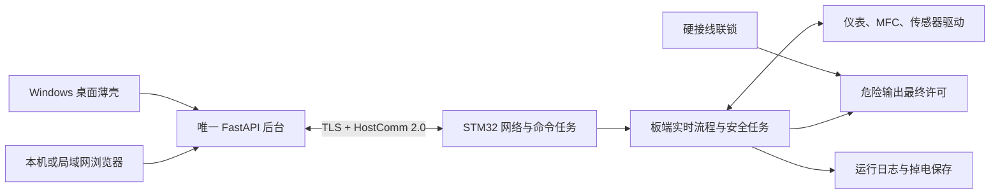

# HostComm 2.0：STM32 固件开发契约

文档修订：`2.0-doc.2`，2026-09-07；设计基线和线上握手仍为 `2.0-design.1`。协议字段 `protocol_version="2.0"`。本目录是项目拥有的设计基线，可据此开展上位机适配和固件开发；目标固件尚未开发，旧安装包 `0.3.0-rc.2` 仅使用 HostComm 1.0；`0.3.0-rc.3` 增加显式选择的 2.0 上位机适配和无执行器模拟器，见[运行与配对](runtime.md)、[软件验证](../../verification/2026-09-06-hostcomm-v2-runtime.md)。固件与真机验收仍独立进行。

用户已确认不需要等待既有固件来反推契约。协议语义由本项目定义；用户随后提供[STM32H750VBT6 板卡资料](../../hardware/stm32h750vbt6-board.md)，指明 LAN8720、W25Q128、24C02 和 ADS8688。板卡修订、原理图、引脚冲突、实装能力、仪表驱动、标定和安全配置仍需核验。[ADR-008](../../decisions/ADR-008-hostcomm-v2-design.md)记录版本和架构决策。

先读[固件开发交接](firmware-handoff.md)：确认职责、阶段目标和验收材料；随后阅读[兼容核对](compatibility.md)与[修订记录](revisions.md)。rc.4保留rc.3通信实现，本轮文档修订不改变应用版本或线上字段。

## 开发入口

| 交付物 | 使用方法 |
|---|---|
| [报文、连接与事务](wire.md) | 实现网络任务、认证、帧解析、命令受理、分块上传与日志补传 |
| [STM32H750 板卡配置](stm32h750-profile.md) | 核对板卡资料对启动、存储、网络、采样与资源验收的约束 |
| [数据、配方与工程配置](data-and-recipe.md) | 实现传感器数据映射、质量、阶段执行和不可修改的安全边界 |
| [状态、停止与恢复](state-and-recovery.md) | 实现板端状态机、故障处置、租约、掉电恢复和测定边界 |
| [机器契约与向量](../../../contracts/hostcomm/v2/README.md) | 校验字段、消息样例、数值字节与摘要；供 C/Python 实现逐项对照 |
| [固件与上位机开发清单](firmware-plan.md) | 按依赖安排驱动、协议、实验和联调，记录每一阶段的证据 |

优先级：本目录规范语义与机器契约共同组成一个设计版本；发现冲突必须修正文档/Schema/向量并通过检查，不能由实现自行选一个。Schema 约束字段形状；时序、权限、持久化和物理条件仍须按规范实施和测试。示例参数只用于编码验证，不能直接烧入生产安全配置。

## 系统边界

浏览器不直连 STM32。上位机管理账户、操作确认、配方编辑、归档、指标和报告；板端执行采样、闭环控制、阶段条件、超时和安全动作。HostComm 不提供任意脚本、寄存器写入、强制 CO、绕过联锁或热态恢复实验的入口。

## 设计状态与启用边界

| 层次 | 本次交付状态 | 还需要什么 |
|---|---|---|
| 协议设计 | design.1作为线上基线；doc.2补齐交接和兼容核对 | 线上语义变更须评估设计/协议版本，说明性修订只升级文档号 |
| 可执行参考 | 有消息/配方模型、编码检查和黄金向量 | C 端独立实现跑相同向量；它不是设备模拟器或控制固件 |
| 上位机运行 | rc.3起已有2.0客户端、配对、操作/配方/源日志；rc.4保留，已知限制见兼容表 | 先关闭主机差异，再分别验证Windows安装包到模拟器及真实固件 |
| STM32 固件 | 尚未开发 | 驱动、实时任务、持久化、TLS 和契约实现 |
| 工程与试验 | 安全参数及部分国标判定仍未批准 | 配置版本、图纸、标定、标准歧义批准、真机异常测试 |

只有目标固件通过自检、工程配置已批准、协议能力满足本版要求且实际设备状态允许，才能开放启动。应用可就绪、设备可通信、设备可控制和实验可判定有效是不同状态。

初始设计检查见[设计验证](../../verification/2026-09-06-hostcomm-v2.md)；本次文档核对见[交接审查记录](../../verification/2026-09-07-firmware-handoff.md)。

## 与 1.0 的迁移

| 当前 1.0 | 2.0 设计 | 迁移动作 |
|---|---|---|
| 明文 TCP 与部分可选响应关联 | TLS 身份与每个响应的 reply_to | 新传输适配器；协议/身份不符拒绝控制 |
| 主机内部 operation_id | 板端持久意图、序号水位与查询 | 新操作适配，旧 unknown 保持未知，不自动补发 |
| 排序 JSON CRC32 / 浮点配方摘要 | 固定点配方、规范字节 SHA-256 | 显式转换并验证可精确表示；生成新配方版本，不改历史摘要 |
| set_parameters 一帧携带整个配方 | 暂存分块、校验、原子激活与回读 | 更新部署事务，不增大旧解析器帧上限 |
| 状态别名及首个接收终态 | 精确枚举、原始边界样本身份 | 按源端边界归档，禁止用重连时刻替代 |
| 检测遥测缺口 | 原始记录分块补传与明确不可用区间 | 新增源记录存储和去重；不将补传送入实时控制 |

不把历史数据补造为 2.0：保留原协议、固件未知项、算法版本与完整性标记。旧配方若缺少显式加热模式、时间条件或工程配置绑定，迁移时要求补齐为新版本。生产现场切换需设备待机、数据库/配置备份、双方版本验活和回退方案；不与运行中的实验混用。

## 外部规范依据

JSON 的互操作与 UTF-8 依据 [RFC 8259](https://www.rfc-editor.org/rfc/rfc8259)；规范字节使用 [RFC 8785](https://www.rfc-editor.org/rfc/rfc8785) 的受限整数子集，额外限制见数据契约。TLS 与 PSK 配对依据 [RFC 8446](https://www.rfc-editor.org/rfc/rfc8446) 和 [RFC 9257](https://www.rfc-editor.org/rfc/rfc9257)。这些资料支持编码与安全机制，不替代本项目的硬件安全评估。
