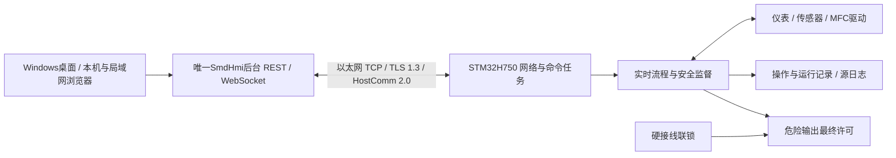

# STM32H750 固件开发交接

文档修订：`2.0-doc.4`，2026-09-20。适配对象为已发布的 SmdHmi `0.3.0`；线上仍使用 `protocol_version="2.0"`、`design_revision="2.0-design.1"`。文档修订号不能填入报文。源码、发行包与文档的版本关系见[修订记录](revisions.md)。

本文件维护交接职责、材料和变更规则。固件工程师实际开工、交底会议及首次联调请从[技术交底主文档](technical-briefing.md)开始；[兼容核对表](compatibility.md)列明主机实现范围。固件开发中、尚未交付验收；未取得可验收的固件构建材料或双方签署的真机兼容结论。

## 1. 共同目标与分工

交付目标是指定 H750 板卡、固件、工程配置和 SmdHmi 版本能共同完成标准及受限阶段式非标实验，并在断线、停止、重启和存储故障后保持可解释的设备状态和原始记录。TCP 连上、页面显示数值或命令返回 accepted 都不是该目标的完成条件。

| 责任角色 | 提供和维护 | 不以其他角色的工作替代 |
|---|---|---|
| 上位机负责人 | 账户权限、操作审计、唯一设备连接、配方编译与回读、持久操作、归档、指标和报告 | 页面确认不代替板端许可；收到 ACK 不代替实际安全反馈 |
| 固件负责人 | 板级网络、认证、帧解析、命令持久化与查询、实时采样、配方阶段、安全状态机、补传 | 不等待上位机定时推进阶段，不自动重放未知动作 |
| 硬件/仪表负责人 | 板卡修订与原理图、引脚和通道点表、驱动协议、量程、标定、存储/启动布局 | 图片标注不等于实装资源或允许同时启用的接口 |
| 试验/安全负责人 | 国标歧义批准、气体参考状态、物理联锁及失电/置换/冷却策略 | 合成 profile、模拟器通过不等于工程批准 |
| 联调/验收负责人 | 固定双方版本、用例和故障注入，保存原始证据，维护缺陷关闭记录 | 安装成功不代替通信、完整实验或24小时验收 |

当前每个角色的具名负责人尚待项目分配；不能将此表视为人员已认领或签字。

## 2. 通信机制速读

1. **连接与认证。** STM32 是服务端，后台是客户端，生产默认端口 `34211`。使用 TLS 1.3 外部 PSK、P-256 和指定 AES128 套件；设备身份、控制器身份、epoch 与密钥在线下配对。浏览器不直连板卡，管理员登录口令也不是 PSK。
2. **分帧与类型。** 每帧是 UTF-8 JSON 对象加一个 LF，JSON 最多8192字节；处理拆包/粘包，严格拒绝非法和额外字段。工程量用固定点整数，uint64用十进制字符串。配方/日志及摘要采用规范字节，不能照旧1.0浮点/CRC方案实现。
3. **握手与恢复。** TLS后 hello/hello_ack 核对固定设计修订、身份、四项能力及 profile 摘要；建立新 session/boot 关联，再读取工程配置、状态、操作水位、报警和源日志。主机完成恢复及状态校验后才放行普通控制。
4. **控制与结果。** 普通写操作使用8秒板端租约；心跳续期。命令先持久化身份、递增序号和意图，再返回受理/结果。超时后查询原操作，不自动重发；停止有独立通道，仍需认证并绑定明确运行。
5. **配方与采样。** 配方分块上传、校验、原子激活，再由主机读取完整原字节确认；采样和阶段由板端产生。自然测定结束、停止受理、置换、冷却、安全完成与确认归档分别表达，期间继续保留原运行的数据。
6. **日志恢复。** 实时遥测/事件与持久日志使用可核对的源身份。补传固定区间，主机落盘后ACK；缺口明确保留，历史补传不驱动实时控制，也不能自动判定实验有效。

这是阅读顺序，不是第二份字段规范。精确约束见[报文与事务](wire.md)、[状态与恢复](state-and-recovery.md)、[数据与配方](data-and-recipe.md)和[机器契约](../../../contracts/hostcomm/v2/README.md)。字段及代码差异按[兼容核对表](compatibility.md)处理，不能任意选一份解释。

## 3. 交给固件人员的材料

| 材料 | 交付位置 | 接收方需要做什么 |
|---|---|---|
| 技术交底与联调记录模板 | [技术交底主文档](technical-briefing.md) | 回填板卡/网络/工程配置，逐消息实现并按阶段保存预期、实际及证据 |
| 本交接说明、版本与差异 | 本页、[revisions](revisions.md)、[compatibility](compatibility.md) | 确认同一快照，逐项认领差异和阶段退出条件 |
| 线上契约 | wire / state / data 三份规范及全部 Schema | 逐消息映射 C 类型、任务、错误和持久化边界 |
| 规范字节与固定向量 | [contracts/hostcomm/v2](../../../contracts/hostcomm/v2/README.md) | 用独立 C 实现跑同一向量；保留原字节和摘要，不能自行重新生成预期值 |
| SmdHmi参考实现和测试 | [v2客户端](../../../backend/app/hostcomm/v2_client.py)、[传输](../../../backend/app/hostcomm/v2_transport.py)、[软件验证入口](../../verification/2026-09-06-hostcomm-v2-runtime.md) | 根据规范实现固件，用代码核对当前主机接受范围，不照搬Python对象作为线上字段 |
| 无执行器模拟器 | [源码入口](../../../backend/app/hostcomm/v2_simulator/__main__.py)、[运行说明](runtime.md) | 在隔离的本机测试环境重现主机行为；模拟值和测试驱动不转为设备工程配置 |
| 板卡与工程资料 | [板卡资料及原图](../../hardware/stm32h750vbt6-board.md)、[H750 profile](stm32h750-profile.md)、[Q清单](../../待确认事项与接口对齐清单.md) | 补齐真实接线、仪表协议、量程/单位/采样/质量、标定、联锁和存储预算 |
| 实验要求 | [国标映射](../../experiment-spec.md)、批准后的SOP/工艺与安全配置 | 区分炉温与料层温度、测定与冷却边界，保留Q9/Q11/Q12未批准项 |

轻量离线资料包从本次文档 PR 的最终提交生成完整受版本控制源码快照，保留目录结构；包内包含阅读入口、完整提交 SHA、版本对应表和文件摘要，包外提供 ZIP 的 SHA-256。包可离线阅读，不包含安装器、SmdBench 二进制、开发运行环境或 Git 历史；执行 Python/JavaScript 检查需另备开发环境。离线包的来源 SHA 必须与交接记录一致，不能以包名替代文件摘要核验。

配对材料按[离线配对流程](runtime.md)单独受控交接。仓库、普通文档包、PR及日志不携带真实PSK、账户密码、JWT或现场数据库；固件人员只需被授权的设备身份与对应密钥材料，不需要整份上位机配置备份。

## 4. 开工对齐与分阶段验收

首次对齐会议产出一份记录：双方源码SHA、文档修订、三份Schema和向量摘要、板卡/工程配置版本、各角色负责人、下表当前阶段、未决项编号与预计关闭时间。暂缺内容写“待提供/未验收”，不填虚构默认值。

| 阶段 | 有界交付 | 退出证据 |
|---|---|---|
| H0 接口认领 | 固件人员完成材料阅读，认领Q项与兼容差异，列出消息/模块实现表 | 双方确认的版本组合、责任人和缺口清单 |
| H1 安装版软件联调 | 独立SmdBench在隔离环境连接同提交安装版服务与同机TLS模拟器，通过Chromium操作共用后台 | Windows CI的身份握手、配方、运行/停止/冷却、归档、实际报告及补传通过；清理、封装与下载产物核验通过，0.3.0结论绑定[发行验证](../../verification/2026-09-13-overwrite-install.md)中的提交和字节；Win10/11 WebView2人工验收另列M4 |
| H2 纯C核心与板卡基础 | FW-02独立C向量、解析/边界检查；并行FW-01板卡与网络/存储评估 | C与Python/JS规范字节一致，内存检查；链接map、时钟/PHY/DMA/cache和存储布局证据 |
| H3 板端通信与持久事务 | FW-03/04及FW-06/07/08纯逻辑部分：用注入测量、惰性输出测试认证、租约、操作、状态机、配方与日志，不关闭物理任务 | 真实H750握手和资源曲线；重复/丢回执/掉电/缓存淘汰/满存储行为符合契约；明确使用测试驱动的通道 |
| H4 实际设备流程 | FW-05实装驱动、FW-06/07/08工程集成及FW-09：接入仪表、MFC、采样和批准的工程安全策略 | 每通道独立对照、状态/停止与联锁注入、标准及非标全程与报告核对 |
| H5 发布验收 | FW-10及M4/M5剩余项目 | 指定组合最高批准采样率24小时、断电恢复和责任人签字 |

H1的软件发行证据已取得，H2可并行推进；SmdBench只连接回环模拟器，不能直接用作真实板卡测试工具。目标板早期只实现以太网或少量消息时，用台架诊断验证；不得假报四项能力以骗过主机握手。能通过hello也不代表profile已批准或允许接入危险执行器。

每次联调按[验收格式](../../verification.md)记录：用例编号、双方SHA、板卡/配置、输入/故障注入、预期、实际、原始日志或数据摘要、通过/失败及责任人。至少包含：错身份/密钥拒绝、半帧/超长帧、丢启动回执后查询、相同身份返回原结果、冲突/淘汰不重做、普通请求拥塞时停止、板端重启、配方激活断电、日志缺口/损坏、首滴断线补传和冷却未达条件时禁止确认结束。

固件阶段和软件缺口的状态统一维护在[任务清单](../../../tasks/todo.md)，本页不另建一份容易分叉的勾选表。

## 5. 变更与交付规则

固件人员发现字段/时序歧义时，提交最小报文或故障轨迹，并给出涉及的规范、Schema、主机函数和预期；先在兼容表登记编号。双方确定语义后，规范、模型、向量、模拟器、主机/固件实现和回归证据一并审查。

纯说明纠错升级文档修订；改变字段、能力、数值或拒绝/恢复语义必须评估线上design_revision及protocol_version，不能只改文档号。旧安装包严格校验设计修订和未知字段，新增字段不能假定可向后兼容。需要改变安全架构时另写ADR并经工程负责人确认。

交付固件至少附：源码/二进制SHA、工具链/BSP/RTOS/TLS依赖版本、链接map和分区表、支持的协议/设计修订、设备/工程profile摘要、烧录/配对/恢复说明、已执行测试及未通过项。安全配置与密钥分别管理；不能将测试profile或密钥固化为全设备默认值。
