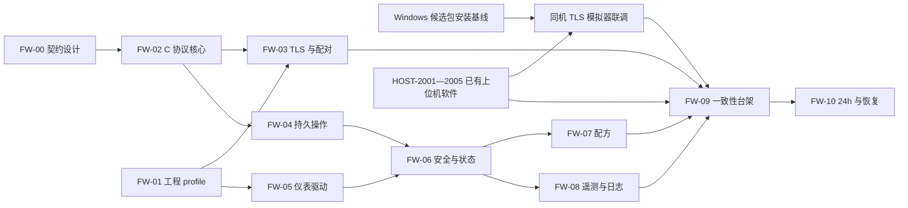

# HostComm v2.0 固件与上位机实施路线

文档修订：`2.0-doc.3`（2026-09-08）；设计基线 `2.0-design.1`、线协议 `2.0` 不变。固件尚未开发；上位机适配、离线配对工具与软件模拟器已实现，见[运行说明](runtime.md)及 [rc.3 运行验证](../../verification/2026-09-06-hostcomm-v2-runtime.md)。rc.4 沿用这些功能并增加安装诊断修复，不能将安装结果记为固件验收。

规范入口为 [v2.0 总览](README.md)、[报文与数据格式](wire.md)、[状态与恢复](state-and-recovery.md)及 [ADR-008](../../decisions/ADR-008-hostcomm-v2-design.md)。任务状态只在[执行清单](../../../tasks/todo.md#hostcomm-v20-与新固件)更新，本文维护拆分依据、开发顺序和验收方法。

## 交付边界

已有交付包括协议设计、机器可读格式、向量与检查器，以及 HOST-2001—2005 列明的上位机软件和模拟器回归。纯 C 核心、STM32 固件、双方台架一致性及指定设备实测仍待完成；`implemented` 不表示 FW-09、Windows 现场或 M5 已通过。

近期先建立 **Windows 安装包与同机 TLS 模拟器联调，并行 C 核心，再到目标板** 的可重复交接。用户已确认 rc.4 安装成功；空库来源、升级路径、设备配对和 Windows 包与 TLS 模拟器的完整业务仍须分别留证。下一步从[同机联调入口](runtime.md#7-独立windows联调工具)验证已有软件链路，同时为 C 核心准备固定向量和可注入时钟/存储接口。

可以立即开展纯 C 解析器、规范字节、命令事务、状态机和配方执行器的主机测试。用户补充的[板卡资料](../../hardware/stm32h750vbt6-board.md)指明 **STM32H750VBT6、LAN8720、W25Q128、24C02、ADS8688** 及接口引脚。芯片/板卡修订、原理图、引脚冲突、RTOS、实装存储布局和仪表通道仍需核验。器件资源和目标验证见 [STM32H750 工程 profile](stm32h750-profile.md)；不得将相关 TMH 仓库默认为本项目的 BSP 或固件。

物理量程、标定、MFC 气体参考状态、联锁点位、CO 置换要求及安全动作时序仍依赖设备工程资料。协议规定这些内容如何标识、校验和审计，不为未选定的设备填写“已批准”安全参数。

## 固件模块边界

| 模块 | 职责 | 接口限制 |
|---|---|---|
| 板级与仪表驱动 | 时钟、看门狗、网络、非易失存储，传感器/MFC/仪表读写 | 报告原始值、采样时间和质量；HostComm 不直接访问寄存器或 I/O |
| 安全监督 | 连续判断急停、排风、CO、温度及驱动故障，执行批准的安全处置 | 优先于配方和网络；硬接线仍保留最终切断权 |
| 实验执行器 | 受限阶段列表、转换条件、超时、测定边界及冷却 | 使用不可变运行快照；断线或重启不自动续开 CO/加热 |
| 操作协调器 | 配对控制器、租约、命令序号、高水位、操作状态及对账 | 在副作用前持久化必要意图；结果缓存淘汰不解除防重放 |
| 采样与日志 | 源序号、单调时间、时间质量、报警和可查询日志范围 | 日志写入失败显式退化；补传不伪造缺失样本 |
| HostComm 服务 | TLS、严格分帧/解析、消息校验、请求关联、有限队列与分块传输 | 无效帧不得触发操作；网络拥塞不能阻塞安全监督 |

模块通过有界消息或明确接口通信。RTOS 任务和中断安排由选定 BSP 实测决定；安全截止时间不能依赖主机回执、TLS 进度或日志写入完成。

## 固件任务拆分

| ID / 优先级 | 交付物 | 责任角色 | 依赖 | 验收与证据 |
|---|---|---|---|---|
| FW-00 / P0 | v2.0 设计、schema、向量及检查器 | 协议/后端负责人 | 用户设计授权 | 规范相互一致；正向、拒绝及摘要向量通过检查；记录设计提交与命令输出 |
| FW-01 / P0 | STM32H750 目标板与受控工程 profile | 固件/硬件/仪表/安全负责人 | Q2/Q5/Q13 | 板卡资源资料已入库；补齐板卡修订/原理图、复用冲突、点表、标定、安全范围、程序及持久存储方案和失效策略 |
| FW-02 / P0 | 可在主机运行的纯 C 协议核心 | 固件负责人 | FW-00 | 拆包/粘包、UTF-8、重复键、整数范围、超长帧恢复与摘要向量通过；ASan/UBSan 或等效检查 |
| FW-03 / P0 | TLS 端点、设备配对和有界会话 | 固件/安全负责人 | FW-01/02 | 正确 PSK 握手；错误身份/密钥拒绝；无明文降级；峰值内存与重连资源稳定 |
| FW-04 / P0 | 操作日志、高水位与结果查询 | 固件负责人 | FW-02、FW-01 存储方案 | 每个持久边界断电后重复命令不再次执行；缓存淘汰、epoch 不符、存储满有明确结果 |
| FW-05 / P0 | 传感器、仪表和 MFC 驱动纵向接入 | 固件/仪表负责人 | FW-01 | 逐通道对照独立测量；断线/超时/越量程质量正确；气体参考状态可追溯 |
| FW-06 / P0 | 安全监督与实验状态机 | 固件/安全负责人 | FW-01/04/05 | 租约失效、故障、停止、板端重启进入规定处置；受理/测定/安全/冷却边界独立可回放 |
| FW-07 / P0 | 配方暂存、原子启用及阶段执行 | 固件负责人 | FW-02/04/06 | 乱序/重复分块、错误摘要、提交掉电不替换有效版本；运行快照、目标语义和超时符合契约 |
| FW-08 / P1 | 源遥测、报警日志与分块补传 | 固件负责人 | FW-04/05/06 | 源序号单调；快照查询不制造采样缺口；日志过期、损坏、存储满和慢读者均显式报告 |
| FW-09 / P0 | 固件与上位机一致性台架 | 固件/后端/测试负责人 | FW-03/07/08、HOST-2004 | 完成同一设备版本上的认证、参数/配方、运行/停止、重连与补传；故障矩阵有原始日志 |
| FW-10 / P1 | 最高批准采样率 24h 与恢复实测 | 固件/测试/现场负责人 | FW-09、M4-06 | 队列、内存、存储、丢样、命令延迟有时间序列；断电/主机崩溃/日志轮转恢复可解释 |

本轮交接所说的“FW-02最小核心批次”覆盖纯C分帧/类型（FW-02）、可在主机验证的TLS会话与握手（FW-03）、心跳租约/状态快照（FW-06纯逻辑）和命令结果查询（FW-04）。保留这些任务编号便于追溯；先使用可注入时钟/存储和无执行器端点跑同一契约向量，再把端点替换为STM32H750。目标板TLS资源、真实持久存储和物理安全策略仍须分别验收，不能凭最小核心通过关闭FW-01/05/09/10。

FW-01 中未定的硬件资料只阻塞相关目标板接入与物理验收。FW-02 及使用可注入存储/时钟接口的 FW-04、FW-06、FW-07 纯逻辑部分可并行推进，不能因等待引脚表而停下协议实现。

## 上位机适配任务

| ID / 优先级 | 交付物 | 责任角色 | 依赖 | 验收与证据 |
|---|---|---|---|---|
| HOST-2001 / P0 | 显式 v2.0 连接配置与严格客户端 | 后端负责人 | FW-00；台架依赖 FW-03 | TLS/配对身份、帧限长、关联响应和能力验证通过；1.0/2.0 不自动降级或混用 |
| HOST-2002 / P0 | v2.0 操作协调与持久恢复 | 后端负责人 | HOST-2001、FW-04 | 迁移保存控制器 epoch/命令序号、租约与查询依据；重启/丢回执不自动重放副作用 |
| HOST-2003 / P0 | 定点配方、分块提交及回读 | 后端/前端负责人 | HOST-2002；固件对接依赖 FW-07 | 上位机单位转换、摘要与原字节回读已纳入软件回归；C/Python 一致性仍由 FW-02/07 补齐；旧配方生成新快照 |
| HOST-2004 / P1 | 源日志入库、缺口补传及报警对账 | 后端负责人 | HOST-2002、FW-08 | 游标与样本同事务；重复补传不重复计量；过期/损坏/不可恢复区间保留质量标记 |
| HOST-2005 / P0 | 双端兼容回归与候选包 | 后端/前端/发布/测试负责人 | HOST-2003/2004；实物验收依赖 FW-09 | 软件检查与候选包已有证据；Windows 包与 TLS 模拟器、现场升级及固件台架分别验收，不以候选包构建代替 |

现有 REST/WS、认证和界面继续共用后台。v2.0 的线格式、源记录与设备操作语义在后台适配，不把 TLS 凭据、原始命令或设备租约下放给浏览器。

旧记录没有 v2.0 epoch、摘要或源序号时保留未知，不能通过数据库迁移补造。历史 1.0 配方与新定点配方的摘要不相等；转换是有审计的新版本，不能重写原来的配方或实验快照。

## 顺序与检查点

1. **软件交接检查点**：记录 Windows 包版本、服务/登录状态及数据来源；独立配对到同机 TLS 模拟器，验证状态就绪、配方回读、操作核查和日志补传。完整测定、置换、冷却与结束确认还需测试驱动和原始轨迹，不能仅凭启动 CLI 宣称通过。
2. **协议检查点**：FW-02 在主机通过全部跨语言向量；解析失败不得调用操作回调。只证明协议核心，不放行物理输出。
3. **控制检查点**：FW-03/04 与 HOST-2001/2002 在惰性执行器上验证认证、租约、持久去重及未知结果。先证明重复包不会重复动作，再接入仪表执行。
4. **工艺检查点**：FW-05—08 的目标板集成使用已批准 profile；先完成安全监督和故障注入，再测试完整配方。未批准安全 profile 不允许实验启动。
5. **交付检查点**：FW-09 与 HOST-2005 形成明确软硬件组合；FW-10、Windows 现场、标准判定和联锁签字全部满足后，才完成 M5 指定设备组合资格验收。软件正式版依据[ADR-011](../../decisions/ADR-011-overwrite-install-and-software-release.md)另行验收，不把软件版本号视为真机通过。

## 资源预算和能力声明

STM32H750 的 128 Kbytes 片内 Flash 需要提前验证程序和持久数据分配。FW-01 须提交链接 map、分区、Ethernet DMA/cache 布局及外部介质的实装证据；现有 W25Q128 标注不证明 QuadSPI XIP，SD 是否实装也未确认，不能预设完整 TLS 与日志都放得下。器件来源和存储方案边界见 [STM32H750 工程 profile](stm32h750-profile.md)。

传输基线为 TLS 1.3 外部配对 PSK、`psk_dhe_ke`、`TLS_AES_128_GCM_SHA256`、`secp256r1`，禁止 0-RTT 和首版会话恢复；具体规定以 wire 为准。配对密钥为 32 字节随机值，通过受控维护方式配置，不写入仓库、普通日志或实验报告。

JSON Lines 单帧上限为 8192 字节，不含末尾 LF。配方最多 65536 字节，以每块不超过 1536 原始字节传输；这些是协议边界，不是目标 MCU 已测得的资源能力。实现必须同时核算 TLS、解析器、Base64、规范化暂存、并发队列与日志缓冲峰值，不能只按帧大小估算 RAM。

源计数使用十进制字符串承载 uint64，物理量使用契约定义的定点整数。C/Python 共享精确 UTF-8 字节与 SHA-256 向量，尤其覆盖中文、零、边界整数、错误编码、不同键序和非法浮点；不能依赖各语言默认 JSON 浮点序列化。

持久日志预算至少涵盖“批准最高采样率 × 单条最大存储字节 × 声明保留时间”、事件/操作日志、索引与掉电恢复余量，并单独测算写入寿命。板卡资料标有 W25Q128/24C02，但项目尚未确定实际分区、最高频率和保留时长；这些由 FW-01/08 验证后写入 profile 和能力声明。

高水位、防重放身份与未决操作不能随着结果缓存或遥测环形日志一起淘汰。持久介质失效时停止受理需要可靠持久化的新副作用操作，保持故障可见并执行独立安全策略；不得退回仅靠 RAM 去重。

## 必备故障证据

| 场景 | 必须证明的行为 |
|---|---|
| 错 PSK、未配对控制器、降级尝试 | 握手或控制被拒绝；不会因连通而可控制 |
| 拆包/粘包、超长行后合法帧、重复键 | 帧边界明确，非法内容不执行，恢复解析没有残片注入 |
| 副作用前后任意持久写点断电 | 重启保留高水位与操作证据；结果不明明确 unknown，重发不重复动作 |
| 两台主机争用、租约过期、旧连接复活 | 控制权与请求身份符合契约；停止路径独立于普通控制租约；过期主机不能恢复执行 |
| 丢回执、后台重启、板端重启 | 查询/对账保留原操作身份；不根据 TCP 重连自动续实验 |
| 配方分块丢失/损坏、提交中断、旧启动摘要 | 未完整验证的配方不成为执行版本；运行期间快照不变 |
| 传感器失效、MFC 超时、首滴无效 | 质量与报警保留；物理安全动作符合批准 profile，算法不造值 |
| 日志满、日志游标过期、补传重叠、慢主机 | 丢失范围明确；不误报完整，不重复归档，不堵塞安全/回执 |

每条证据记录协议版本、schema/向量提交、硬件修订、固件 SHA、上位机 SHA、profile 版本、注入点、预期、实际与原始产物。真实断电和联锁测试还需现场责任人确认，软件模拟记录不能代替它们。
