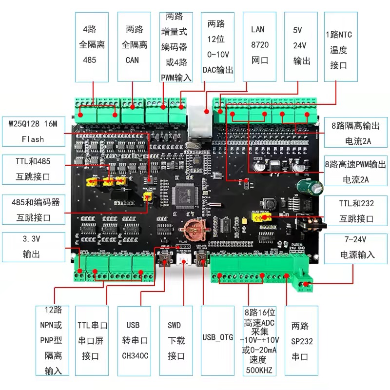
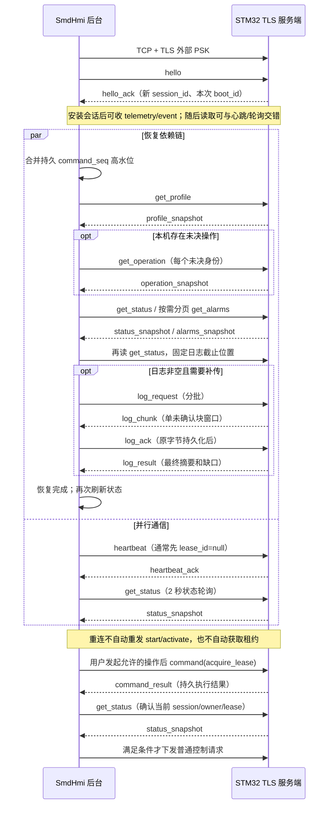

# STM32H750 固件技术交底与首次联调手册

文档修订：`2.0-doc.4`，2026-09-20。上位机基线：**SmdHmi 0.3.0**；线协议：`2.0`；握手 `design_revision`：`2.0-design.1`。固件按现有契约开发，本次不增加字段、命令或能力。

本手册用于双方交底会议、工程资料回填和首次实板联调。固件工程师先读本文，再按链接实现规范及机器契约；项目职责、变更审查和交付规则继续由[固件交接说明](firmware-handoff.md)维护。遇到规范、Schema、固定向量或代码不一致时，记录差异交双方评审，不能靠猜测或放宽校验接通。

**当前证据边界：**用户已报告 0.3.0 安装成功；固件开发中、尚未交付验收。已有软件/模拟器证据见[发布验收](../../release-acceptance.md)；本文所有实板验收项仍为“未验收”。安装成功、模拟器通过、版本去掉 RC，均不代表真实板卡通信、联锁或国标符合性已验收。

## 1. 先确定交付组合和分工

### 1.1 四类版本分别登记

| 对象 | 本次基线 | 现场登记要求 |
|---|---|---|
| 上位机应用 | `0.3.0`；标签 `v0.3.0`；发布提交 `404ecb50edf23864ed482e68cc4a1933deb3383f` | 安装器文件名/SHA-256、服务实际版本、Windows 版本 |
| 通信协议及握手 | `protocol_version=2.0`；`design_revision=2.0-design.1` | 必须精确匹配；不能把 doc.4 发到 design_revision |
| 说明文档及源码资料 | `2.0-doc.4`；离线包 `HANDOFF-README.md` 和 `SOURCE-MANIFEST.json` 登记完整 PR 提交 SHA | 包的 SHA-256 与双方接收日期；Schema/向量以同包文件为准 |
| 固件及工程配置 | **待填写，开发中未交付** | 固件版本/提交/二进制摘要、PCB/芯片修订、profile/完整工程配置摘要及批准人 |

交底前核查基线为主线 `bf8a1953a721ea2087b24ca86055733d00317216`。其中 `backend/app/hostcomm/` 和 `contracts/hostcomm/v2/` 与上述应用发布提交一致；本次 PR 仅补充说明。后续软件或固件版本变化必须重新确认[兼容表](compatibility.md)，不能沿用未执行的验收结论。

| 责任角色 | 必须交付 | 不由该角色自行推定的事项 |
|---|---|---|
| 上位机负责人 | 版本化契约、配对工具、单一设备连接、权限/操作审计、归档与报告；解释实际请求行为 | 物理 I/O 是否成功、安全动作是否已完成 |
| 固件负责人 | TLS 服务端、全部基线能力、持久操作、实时采样/流程/安全任务、日志及目标板证据 | 未经批准的仪表参数、气路与安全限值 |
| 硬件/仪表负责人 | 原理图、跳帽/引脚选择、点表、电平/极性、总线地址、量程和标定 | 图片标注即工程额定值、所有复用口可同时启用 |
| 试验/安全负责人 | 标准规则争议、工程 profile、安全动作/反馈/时限、台架和真机放行 | 把通信通过或 `valid_candidate` 当作标准符合性 |
| 测试/现场负责人 | 固定软硬件组合、故障注入、原始证据、问题单及复验 | 以文档勾选代替实际结果 |

每个角色的姓名、备份联系人和签字日期在第 10 节填写。固件与上位机之间只有 HostComm；Vue 桌面页面与局域网页面共用一个后台，不各自连接控制板。板端必须独立执行实时流程和安全联锁，硬接线保留最终切断权。

## 2. 准备板卡、网络和工程资料

[板卡资料及原图](../../hardware/stm32h750vbt6-board.md)是用户提供资料的归档，[STM32H750 工程 profile](stm32h750-profile.md)说明资源验证要求。下图用于认口，不代替原理图或端子接线图。



资料标注 STM32H750VBT6、LAN8720、SPI2 接 W25Q128、24C02、SPI4 接 ADS8688。需提前核算 128 KB 片内 Flash、分段 RAM、TLS/解析/队列峰值及日志布局；W25Q128 的 16 MiB 不能推定为可直接 XIP 的程序空间，256 B EEPROM 不能作为实验日志库。ADS8688 的器件转换率不能当作 HostComm 上传频率。芯片、PCB 实物修订与存储后缀仍待核对。

### 2.1 开发前回填表

| 编号 | 必填资料 | 当前值/负责人/证据 |
|---|---|---|
| B-01 | 厂商/板卡型号、PCB 版本、MCU 实物订货码/修订、原理图/BOM 版本 | 待填写 |
| B-02 | LAN8720 后缀、PHY 地址、RMII 引脚、参考时钟、复位、MAC 地址 | 待填写；不得按图片推定完整网表 |
| B-03 | PC6/PC7 串口与编码器选择；PD7 输入/灯冲突；SPI3 与 CAN/编码器/输入复用 | 待填写最终引脚矩阵、跳帽照片、审核人 |
| B-04 | 工具链、HAL/BSP、RTOS、网络栈、TLS 库的名称/精确版本/构建选项 | 待填写；先验证 TLS 1.3 外部 PSK 服务端可用 |
| B-05 | 链接 map、启动/救援方式、内部/外部 Flash 分区、Ethernet DMA/cache/MPU 布局 | 待填写；不能只提交编译成功截图 |
| B-06 | 操作水位/运行边界/活动配方的原子写方案；日志容量、预留、寿命与断电测试 | 待填写；不得仅用 RAM 去重 |
| B-07 | 最大批准采样频率、每通道周期/过期时限、最大记录字节、离线保留时长 | 待填写；按最坏记录和冷却时长核算 |
| N-01 | 控制板 IP/掩码/网关、静态或分配策略；上位机网卡 IP、访问范围 | 待填写；本文不预置现场地址 |
| N-02 | HostComm TLS 监听地址/端口、防火墙规则、控制/诊断连接数 | 端口默认 `34211`，实际值待确认；至少一控制、一诊断连接，有界 |
| S-01 | `device_id`、`controller_id`、`controller_epoch`、配对角色/撤销机制 | 待配对后登记；真实 PSK 另行受控保管，不填入此表 |
| S-02 | 工程配置版本/摘要、profile 版本/摘要、批准依据及负责人 | 待填写；未批准时禁止实验启动 |

### 2.2 仪表/MFC 点表模板

复制下表每个通道一行；完整资料作为受控工程配置交付。任何通信映射变更都要核对 profile 摘要和配方绑定。

| 通道/用途 | 实装型号、总线/端口/地址 | 原始寄存器/单位/比例/符号 | 量程/标定版本 | 采样周期/超时/质量判据 | 故障动作/责任人/证据 |
|---|---|---|---|---|---|
| 炉温控制 PV/目标、独立超温保护 | 待填写 | 待填写 | 待填写 | 待填写 | 待填写 |
| 料层温度 | 待填写 | 待填写 | 待填写 | 待填写 | 待填写 |
| 压差、位移/高度、滴落质量（各自分行） | 待填写 | 待填写 | 待填写 | 待填写 | 待填写 |
| 首滴检测器及关联料温 | 待填写 | 边沿/去抖/样本对齐规则待填写 | 待填写 | 最大对齐偏差待填写 | 待填写 |
| N₂ / CO MFC（分别填写设定与反馈） | 待填写 | 标态温度/绝压/气体模型待填写 | 待填写 | 待填写 | 失联、反馈不符动作待填写 |
| 急停、CO 检测、排风、气源、阀门/加热反馈（各自分行） | 待填写 | 正常/故障极性待填写 | 待填写 | 去抖、检测时限待填写 | 待填写 |

安全配置还必须登记阀门失电位置、撤 CO/撤加热顺序、N₂ 置换条件/流量/时长、排风、冷却阈值/稳定时间、反馈与看门狗策略。非标配方不能解除这些上限；未经批准不能用模拟器参数补齐。

## 3. 建立 TLS 和离线配对

### 3.1 双方必须一致的连接参数

| 项目 | 固定要求 |
|---|---|
| 网络角色 | STM32 为 TCP/TLS 服务端，SmdHmi 后台为客户端；默认 `34211` |
| TLS | TLS 1.3；`TLS_AES_128_GCM_SHA256`；`psk_dhe_ke`；`secp256r1`（P-256） |
| 禁用项 | 0-RTT、会话恢复/ticket、证书替代 PSK、明文探测/自动降级；不能退回 1.0 |
| 密钥 | 每对板卡—后台独立 32 字节随机 PSK；文件为 64 个十六进制 ASCII 字符，可带一个末尾 LF/CRLF；TLS 使用解码后的 32 字节 |
| PSK identity | `smd2/<device_id>/<controller_id>/<controller_epoch>`；三项均为 32 位小写十六进制 UUID |
| 身份校验 | hello 的控制器身份与 TLS 配对一致；expected_device_id 匹配本板；hello_ack 回显 device_id 和 controller_epoch，不含 controller_id 字段 |
| 授权角色 | `control` 或 `diagnostic`，由板端配对清单决定；页面管理员角色不等同于板端角色 |
| 基础能力 | `durable_operations`、`atomic_recipe`、`sample_log`、`alarm_log`，恰好各一次，须真实实现；diagnostic 也不能用残缺能力完成基线握手 |

选择 TLS 库时先完成外部 PSK、指定套件/曲线及目标板资源实验，再冻结版本。只做 hello 的早期固件可用独立 C 单元测试逐步验证，**不得虚报四项能力以使正式 HMI 显示连接成功**。详细安全语义和异常关闭规则见 [wire 第 1—3 节](wire.md)。

### 3.2 Windows 0.3.0 的实际操作

以下由本机管理员执行；`<…>` 为必须替换的占位值，不能原样粘贴。默认安装/数据路径分别是 `C:\Program Files\SmdHmi`、`C:\ProgramData\SmdHmi`，自定义路径以实际安装记录为准。

1. 固件先提供板卡身份、网络参数和离线导入方法。按工程批准流程将设备安全关闭；停止 Windows 服务不等于设备安全停机。
2. 在管理员 PowerShell 确认实际服务路径/版本，再停止服务并运行已安装的配对工具：

```powershell
Get-CimInstance Win32_Service -Filter "Name='SmdHmi'" | Select-Object Name,State,PathName
Stop-Service SmdHmi
$PairingTool = 'C:\Program Files\SmdHmi\versions\0.3.0\SmdUpdate\SmdUpdate.exe'
& $PairingTool --install 'C:\Program Files\SmdHmi' --pair-device '<设备32位小写UUID>' --reason '首次固件离线配对'
if ($LASTEXITCODE -ne 0) { throw '配对未完成，保留事务并查看本机日志' }
```

3. 首次配对可由工具生成控制器 ID、epoch 和随机 PSK；已有同设备数据库身份会保留。预先分配的密钥用 `--import-psk '<私有文件路径>'` 导入，不能把密钥正文放命令行。已有配对替换需 `--replace-pairing` 和理由；更换 epoch、控制器或恢复中断必须按[运行说明第 3—4 节](runtime.md)处理，不能手改数据库/水位或删除维护锁。
4. 工具成功后，从受限目录 `config\pairings\<事务ID>\` 受控交接 **`firmware-pairing.json` 和本次 `controller-psk.hex`**。元数据有三项身份、TLS identity、角色和密钥文件名，不含密钥正文。板端导入后核对身份与角色；不要将整个事务目录交给工程师，因为还含旧配置、数据库及密钥备份。板端凭据导入/撤销实现及凭据保管责任人须单独验收。
5. 服务保持停止，管理员在本机编辑实际数据目录的 `config\service.env`，每个配置只保留一个有效定义：`PROTOCOL_VERSION=2.0`、`HOSTCOMM_MOCK=false`、`HOSTCOMM_HOST=<板卡实际IP>`、`HOSTCOMM_PORT=34211`（或双方确定端口）。配对工具已写入三项身份及 `HOSTCOMM_PSK_FILE`，不要改动它们或输出完整文件。工具没有 `--host`/`--port`/`--role` 参数，也不会代填地址或自动重启服务。
6. 确认板端已启用 TLS 监听、凭据导入完成，才执行下列检查并启动服务。端口探测只证明 TCP 可达，不能证明 TLS 或控制许可。

```powershell
Test-NetConnection -ComputerName '<板卡实际IP>' -Port 34211
Start-Service SmdHmi
Get-Service SmdHmi
```

7. 在页面和脱敏服务日志中核对第 4 节的每一道门槛。离线 PSK 只允许服务身份及管理员访问；初始管理员登录密码与设备 PSK 无关。已升级安装保留旧配置，不能假定自动切换到了协议 2.0。

配对工具会检查服务已停、系统互斥锁、真实数据库、未闭合实验及未决操作；失败时先解决对应记录，不能强行绕过。配对中断使用同一工具的 `--recover-pairing`，继续既有事务，不重新生成身份/密钥；详见[运行说明](runtime.md)及[配对实现](../../../desktop/smd_desktop/pairing.py)。现场密钥不进入本手册、PR、离线资料 ZIP 或普通截图/日志。

## 4. 首次连接、重连和持续控制

### 4.1 联调按门槛定位

| 门槛 | 通过证据 | 尚不能推出的结论 |
|---|---|---|
| 应用就绪 | Windows Service/登录/历史查询正常 | 板卡已联网；设备离线不影响应用维护 |
| TCP 可达 | 板端监听及端口连接成功 | PSK、身份、协议正确 |
| TLS 认证 | 双方实际协商 TLS 1.3/指定套件/外部 PSK | hello 和能力检查通过；`v2.tls_credentials_loaded` 仅为连接前本地检查 |
| hello 完成 | device/epoch、版本和四能力集合通过校验，取得合法 profile 摘要声明（内容及状态摘要后续交叉核验） | 持久操作/状态/日志已对账；control_ready 是握手提示 |
| 主机恢复完成 | profile、水位、未决操作、状态/报警及所需日志恢复成功 | 自动拥有租约，或任意操作可执行 |
| 持续控制门控 | control 角色、批准 profile、新鲜状态；无当前租约时可进入待申请状态，已有租约则须有效且归属本会话并已确认 | 自动开始实验；普通写下发前仍需取得有效租约，并检查具体命令、安全与配方条件 |

当前 HMI 投影在无租约且其他条件满足时，可报告 `control_ready=true` 和 `control_lease_acquire_required=true`，表示操作前还需申请；这两个是主机投影字段，不是新线字段。不能将这一状态或 hello 的提示解释为可以跳过租约下发普通写请求。

实际行为依据：[客户端](../../../backend/app/hostcomm/v2_client.py)、[传输层](../../../backend/app/hostcomm/v2_transport.py)、[状态投影](../../../backend/app/hostcomm/v2_projection.py)、[操作协调](../../../backend/app/services/v2_operations.py)。下图表示依赖关系；心跳和状态轮询可与恢复穿插，固件不能只支持图中严格串行的一条脚本。



`hello` 的会话/boot/reply_to 为 null、uptime_ms 为字符串 `"0"`；`hello_ack.reply_to` 指向 hello，之后所有帧必须匹配当前 session 和板端 boot。get_status/get_profile 的 payload 是 `{}`，不是 null。响应必须关联具体尚未完成的请求；不能主动推送 operation_snapshot，应发 operation_changed 事件提示主机查询。

### 4.2 时限、租约和优先级

| 项目 | 实现/联调要求 |
|---|---|
| 心跳 | 发送起点间隔 2 秒，仅一个在途；写锁等待、发送和响应共用 3 秒总期限，不能各等 3 秒 |
| 租约 | 板端单调时钟 8 秒；只由当前拥有者携带正确 lease_id 的心跳续租；断开立即撤销，半开到期撤销 |
| 心跳字段 | ACK 的 lease_id/lease_expires_uptime_ms 同空或同非空；非空续租须匹配请求且剩余期限在 `(0,8000]` ms；违规回执立即撤权断连 |
| 空租约心跳 | 只探活；即使 ACK 带租约，也不能取得、替换或清除本地控制权 |
| 主机期限 | 从请求开始单调时间加响应剩余期限计算；旧 session/boot/本地代次或迟到响应不能恢复失效权限 |
| 状态版本 | 心跳更高 state_revision 触发重读，取得对应状态前暂停普通写；不直接据心跳修改实验阶段；续租本身不递增状态版本 |
| 取得/释放 | acquire 的 applied 结果持久化后，另读状态确认当前归属；释放期间暂停新续租及普通写，未知结果继续查询，不能恢复旧租约 |
| 状态新鲜度 | 当前 HMI 状态快照窗口 5 秒；通道 freshness 来自 profile，另加采样/传输/接收后年龄；均不替代板端实时安全检查 |
| 重连 | 退避基数 1/2/4/8/16/30 秒，实际等待不超过 30 秒；稳定 30 秒且有有效心跳后才重置 |
| 并发 | 普通 command、stop_run、heartbeat 各有独立请求槽；其余只读/传输请求合计最多 4 个；单会话上传及日志传输各最多 1 个 |

独立 stop 槽仍共用同一个 TCP 写锁，不是第二根网线。固件通信任务不得阻塞等待 Flash 擦除、仪表 I/O 或配方循环；本地安全、停止、命令/心跳回执应优先于历史补传。8000 ms 租约是网络控制界限，不是急停或 CO 泄漏的物理响应指标。

## 5. 固件消息与持久操作实现清单

### 5.1 分帧和校验公共要求

一帧为 UTF-8 JSON 对象加一个 LF：JSON 最多 8192 字节（不含 LF）、深度最多 16；不发 BOM、CRLF 或空行。处理 TCP 拆包/粘包；超长行丢弃至 LF，首字节后 5 秒仍未成帧则关闭。普通结构非法帧连续三次断连；错误 session/boot/请求关联等协议违规立即断连，不能混为同一种计数。

所有必填字段包括 nullable 字段都显式给出；未知字段/消息拒绝。禁止重复键、浮点、小数/指数、负零、NaN/Infinity、非法 UTF-8/代理项、布尔充当整数。uint64 使用无前导零十进制字符串，普通整数限 JSON 安全整数范围。规范字节、摘要范围及跨字段约束见 [wire](wire.md)、[机器契约](../../../contracts/hostcomm/v2/README.md)，仅通过通用 JSON Schema 不足以通过固件验收。

### 5.2 全部 26 种消息

H→F 为后台到固件，F→H 为固件到后台。“会话”指已经认证且 hello 完成、session/boot/关联正确。表列出实施入口和常见拒绝条件；完整字段/枚举以 [message.schema.json](../../../contracts/hostcomm/v2/message.schema.json) 和[模型](../../../backend/app/hostcomm/v2_contract/messages.py)为准。普通直接响应不再 ACK，日志 log_chunk 必须按窗口规则回复 log_ack；不合法响应由主机按契约丢弃或断连，不能当成功。

| # / type / 方向 | 用途及前置条件 | 响应/推进 | 拒绝或失败要点；规范 |
|---|---|---|---|
| 01 `hello` H→F | TLS 后校验身份、设计版本、客户端信息 | hello_ack | 身份/版本/结构不符直接关连接，不伪造未协商 error；[wire §3](wire.md) |
| 02 `hello_ack` F→H | 对应 hello；分配 session，返回 boot/角色/四能力/profile/水位 | 启动资源恢复 | 缺失/重复/未知能力声明、device/epoch/套件不符不可接入；真实能力另验；[wire §3](wire.md) |
| 03 `heartbeat` H→F | 会话探活；匹配非空租约才续租 | heartbeat_ack | 不能通过普通消息续租或借空租约取得权限；[wire §4/10](wire.md) |
| 04 `heartbeat_ack` F→H | 对应本次心跳，返回板端期限/状态版本 | 检查期限，必要时刷新状态 | 租约字段不成对、续租标识不符或期限超界立即撤权；[wire §10](wire.md) |
| 05 `get_status` H→F | 会话，只读，payload={} | status_snapshot | 不分配新 sample_seq，不依赖写租约；[状态](state-and-recovery.md) |
| 06 `status_snapshot` F→H | 当前运行/安全/日志/配置/租约/最新样本 | 投影当前状态和恢复目录 | 租约归属字段不齐、边界不合法、摘要变化不得保持控制就绪；[状态](state-and-recovery.md) |
| 07 `get_profile` H→F | 会话，只读，payload={} | profile_snapshot | 不能通过该请求修改或批准配置；[数据 §5](data-and-recipe.md) |
| 08 `profile_snapshot` F→H | 提供受控工程配置投影/资源/摘要 | 验证摘要与 hello/status 一致 | 未批准可诊断；摘要不符、能力超报不得控制；[数据 §5](data-and-recipe.md) |
| 09 `command` H→F | control；持久身份/摘要/boot，另按下表校验 | command_result；后续查询 | 重放冲突、过期序号、许可/存储/队列不满足；[wire §6](wire.md) |
| 10 `command_result` F→H | 对应 command，匹配 epoch/seq/operation_id/摘要 | 记录受理或结果，按需 get_operation | accepted 不等于 applied；不得凭超时伪造失败；[wire §6](wire.md) |
| 11 `get_operation` H→F | 会话，提供 epoch/operation_id/command_seq | operation_snapshot | 查询不重执行；查无/已淘汰不等于未执行；[wire §6](wire.md) |
| 12 `operation_snapshot` F→H | 仅响应上述查询；保持持久身份/历史结果 | 对账未决请求 | 不作为主动推送；旧结果不能回退成成功/重新受理；[wire §3/6](wire.md) |
| 13 `get_alarms` H→F | 会话；首分页及固定修订后续页，limit=16 | alarms_snapshot | 修订变化 state_conflict，后续 page_offset>0 须带 expected_revision；[数据 §2](data-and-recipe.md) |
| 14 `alarms_snapshot` F→H | 当前活跃及待确认 occurrence，原发生身份 | 按 next_offset 继续或结束 | 不混合修订/boot；一页≤16且整帧≤8192，可少发；[数据 §2](data-and-recipe.md) |
| 15 `recipe_begin` H→F | control/有效当前租约，声明摘要/总长/transfer_id | recipe_transfer_result | 无租约、资源忙、超长拒绝；[wire §7](wire.md) |
| 16 `recipe_chunk` H→F | 有效会话暂存及租约；顺序 offset/Base64 | recipe_transfer_result | 越界/空洞/重叠内容冲突拒绝，相同块不重复写；[wire §7](wire.md) |
| 17 `recipe_transfer_result` F→H | 返回 receiving/validated/rejected/expired 和 next_offset | 下一块或独立 activate_recipe | validated 不改变 active_recipe_digest；[wire §7](wire.md) |
| 18 `get_recipe` H→F | 会话，只读；指定 recipe_digest/offset | recipe_snapshot | 摘要或偏移不匹配，不返回另一版本凑数；[数据 §3](data-and-recipe.md) |
| 19 `recipe_snapshot` F→H | 原始规范字节分块、长度、摘要、active | 全件回读/核验再读状态 | 块/长度/摘要或活动身份不一致不得部署成功；[数据 §3](data-and-recipe.md) |
| 20 `telemetry` F→H | 自主推送，reply_to=null；已有源样本/时间/质量 | 无逐样本响应；源日志补漏 | 不能以查询/重发重置身份或年龄，不能替代 run 状态；[数据 §1](data-and-recipe.md) |
| 21 `event` F→H | 自主推送首滴/运行/报警/操作变化，原源身份 | 无逐事件响应；触发查询/日志恢复 | 不用当前温度补首滴，不复用 occurrence；[数据 §2](data-and-recipe.md) |
| 22 `log_request` H→F | 会话；固定 log_id/首末记录/限额 | log_chunk…log_result | 范围/身份/资源不可满足时明确拒绝，不无标记截断；[wire §8](wire.md) |
| 23 `log_chunk` F→H | 关联原 log_request；单个未 ACK 窗口 | 主机持久化后 log_ack | 偏移/块摘要/源身份冲突不得推进；[wire §8](wire.md) |
| 24 `log_ack` H→F | 匹配 transfer_id/next_offset/已提交记录；reply_to=null | 下一块，最后块确认后 log_result | 错偏移/水位不推进；不是新读取请求；[wire §8](wire.md) |
| 25 `log_result` F→H | 关联原 log_request；全部字节 ACK 后给终态/摘要/缺口 | 验证完整覆盖后提交恢复投影 | 超时不能伪造缺口或 complete；[wire §8](wire.md) |
| 26 `error` F→H | 握手后可安全关联的请求，固定 code/message/retryable | 结束关联请求，按原因对账或断连 | 不替代持久 command_result；retryable 不授权重发副作用；[wire §9](wire.md) |

### 5.3 八种 command 及执行点

所有 command 都带 operation_id、controller_epoch、command_seq、lease_id、expected_boot_id、expected_state_revision、request_digest、command、params。摘要是去掉自身字段后的完整规范 payload 的 SHA-256；不能只散列 params。序号从 1 开始，由每个控制器 epoch 持久递增。下面列出 params；其字段类型与完整限制仍以 Schema 为准。

| command / params | 执行前提与 applied 含义 |
|---|---|
| `acquire_lease` / lease_ms=8000 | 没有任何有效租约；lease_id/expected_state_revision 必须 null；applied 表示已授予本会话，主机仍须回读归属 |
| `release_lease` / reason | 本会话当前租约及精确状态；applied 表示撤销；运行中释放进入安全处置 |
| `start_run` / run_id、recipe_digest、safety_profile_digest | idle、批准配置及活动配方匹配、租约/联锁满足；accepted 就原子预约身份并发布 preparing；applied 仅为预检请求进入实时任务 |
| `stop_run` / run_id、reason | 已认证 control、明确当前运行及 boot；lease/state 前置字段必须 null；applied 仅为停止锁存，继续处置/冷却采集 |
| `activate_recipe` / transfer_id、recipe_digest、expected_active_digest | idle 且无活动运行，完整合法暂存、工程配置与预期版本相符；applied 是原子切换点 |
| `ack_run` / run_id | 已证明 safe_complete、报警/故障恢复和确认条件满足；保留档案后设备回 idle，不隐式确认报警 |
| `ack_alarm` / alarm_id、occurrence_seq | 精确 occurrence；记录人类确认，不清除物理 active 条件 |
| `reset_fault` / fault_revision、reason | 当前故障版本、批准恢复条件、活跃原因消失；不能恢复原实验/CO/加热 |

除 acquire/stop 外，lease 和 expected_state_revision 必须非空且有效；所有命令都核对 boot、认证身份及执行点的实时条件。stop 不依赖普通租约、主机恢复完成、状态新鲜度或普通队列空闲，但绝不是匿名网络急停，也不能停止另一个 run。没有任意 set_parameters、物理 I/O 直写、远程标定、自由脚本或 OTA 命令。

持久化实现须逐项完成：

- 身份/结构/摘要验证后先查旧记录，再检查执行许可；合法业务拒绝也消费序号。水位与受理/拒绝记录原子提交，普通动作在意图成功落盘后才进入有界任务队列。
- 同 epoch/seq/operation_id/摘要返回旧结果，不重复执行；身份内容冲突返回 operation_conflict；旧序号明细被回收仍拒绝，返回 result_expired。至少保留 128 条结果，accepted/仍执行及未确认运行关联结果固定保留。
- 队列应用点重查租约、停止锁存、状态、安全条件。start 已预约 preparing 时就要能被 stop 取消，不能等开始升温后才暴露 run_id。
- 断电无法证明动作结果时保留 unknown 或有证据的 interrupted，不能声称物理动作跨断电“恰好一次”。主机超时或重连后仅查询原身份，不自动重发原命令，也不换新 ID 偷重试。
- stop 意图存储故障是明确例外：仍执行可实施的单向安全处置，报告 unknown，禁止新实验；不能因审计写失败拒绝安全处理或谎报 applied。

## 6. 数据、配方与完整实验

### 6.1 编码和源身份

| 数据 | 编码单位/要求 |
|---|---|
| 炉温、目标、料温 | m℃；600 ℃ 编码 600000；炉温与料温不可互换 |
| 升温速率 | m℃/min；10 ℃/min 编码 10000 |
| 压差/高度/质量 | Pa（有符号）/μm/mg；不能将负压差噪声静默截零 |
| N₂/CO 流量 | mL/min；须有工程规定的参考温度 mK、绝压 Pa 和气体模型 |
| 控制计时 | 单调 ms；UTC 未同步时 timestamp=null，不能以接收 UTC 冒充源时间 |
| Point | value、quality、age_ms；good/invalid/stale/unavailable/uncalibrated；无效数据不是可用的 0 |

这些倍率是传输编码，不是精度、量程或安全参数。采样的 `(boot_id,sample_seq)` 只由采样任务分配；事件有原 boot/event_seq/event_id；日志统一 `(log_id,record_seq)` 跨 boot 延续，日志重建换 log_id。查询/重发保留原身份、时间、数值及质量。报警用 alarm_id/occurrence_seq 标识发生实例，不能用报警码替代次数身份。

首滴保存原事件时间、run_id、源样本、当时料温及 is_valid；检测器锁存 true 不能用重连后的温度求 Td。质量无效、未完成、自然完成未滴落是不同结果。炉温升温程序、H600、T10/T40/Ts/Td 及报告判定按[实验规范与国标映射](../../experiment-spec.md)和版本化算法处理；Q11/Q12 等未决规则由试验负责人确认，本文不重定义国标。

### 6.2 配方闭环

顺序为：读取并核验批准 profile → 主机编译校验完整配方 → 取得租约 → recipe_begin → 按确认 offset 发送 recipe_chunk → validated → 持久 activate_recipe → get_recipe 回读全部原字节/摘要 → get_status 核对 active_recipe_digest → 用户明确启动。

配方正文最多 65536 字节，单块最多 1536 原字节，标准带填充 Base64；最多一个会话暂存，120 秒无有效块进展过期。租约失效撤销暂存；新会话重新上传。接收完整不等于激活；断电或坏摘要不能损坏旧活动配方。主机找不到本地配方版本绑定时不能据线配方诊断内容直接启动。

阶段是 1—64 个有序 ramp/hold/gas/cool，目标、加热模式、气体、退出条件和有限超时全部显式给出；不引入脚本、循环或跳转。修改 standard 模板产生 custom 版本，运行使用不可变配方和安全配置快照。到温后保温需分温度到达与计时阶段；温度条件只用新鲜 good 点并持续满足 stable_ms，同刻超时优先。最后 cool 请求由不可编辑的安全子流程接管，不能靠编辑配方跳过置换/冷却。

### 6.3 明确五个边界

| 边界 | 固件证据 | 上位机行为 |
|---|---|---|
| 启动受理 | 运行身份/配方/配置已持久预约，preparing | accepted 不显示为测定成功；允许明确 run 的安全停止 |
| 测定结束 | 原 measurement_start/end；自然完成才 measurement_complete=true | 固定指标窗口；主动停止保留截止但不伪报自然完成 |
| 安全处置 | 停止锁存、撤危险输出、批准置换及反馈 | 继续采集、报警和日志，不因 stop applied 归档结束 |
| 冷却安全完成 | 合格料温严格低于批准阈值（不得高于 200 ℃）及全部反馈；safe_boundary 落盘后 safe_complete | 记录安全终态；cooling 数据仍属于原 run，不延长测定窗口 |
| 归档/设备确认 | 边界、日志完整性、报警/故障处置可核查；显式 ack_run 才回 idle | 报告还要检查数据/规则/回放进度，档案结束不等于自动允许下一实验 |

状态枚举为 booting/idle/preparing/measuring/safe_disposal/cooling/completed/fault/maintenance。fault 不停止安全任务或记录，网络恢复/ACK/复位不能跳回 measuring。跨重启保留 run_id、旧测定边界和原 boot，新 boot 继续安全恢复记录；不得自动恢复加热或 CO。完整转换和 outcome 见[状态与恢复](state-and-recovery.md)。

## 7. 故障处理与恢复约定

| 故障/触发 | 双方必须观察到的结果 |
|---|---|
| 错 PSK、未配对 identity、设备/epoch 不符、错误能力 | TLS/握手拒绝，不能降级；分别检查本地凭据、TLS 与 hello 阶段 |
| 普通命令回执丢失/主机进程重启 | 原操作变未知并查询；固件保持高水位及结果；不得重复启动或激活 |
| 状态过期、心跳发送阻塞/超时 | 主机暂停普通写；到期限撤权；板端失租约自主处置；停止槽保持独立 |
| 释放与心跳/stop 并发 | 旧续租不能复活已释放代次；释放未知保持对账；stop 仍作用于明确 run |
| TCP 重连 | 新 session，清旧租约，恢复查询可与心跳穿插；不自动重启实验 |
| 板端重启/掉电 | 新 boot、旧 run/边界/水位；清租约；安全恢复，无法证明结果则 unknown/invalid |
| 配方上传/提交中断 | 未原子激活的内容不成为活动配方；查询原操作、读回实际版本 |
| 日志损坏/淘汰/容量不足 | 明确源缺口及原因；普通启动按预算拒绝；历史完整性不伪升为 complete |
| 断线期间报警变化 | 固定 active_alarm_revision 分页重同步；修订变化重读；保留原 occurrence 与全局报警 |
| 设备有运行、本机无绑定 | 主机建立待核查运行，保留原数据；管理员/维护人员审查绑定和回放，未知信息留空；不按名称/时间猜配，不妨碍明确 run 的停止 |

日志请求锁定源 highwater、log_id 和闭区间；固件最多支持单次 10000 记录位置/16 MiB，当前 HMI 自动批次最多 1000，应用补传总预算 30 秒且 3 秒无进展超时。每块≤1536 原字节，最多一个未确认块；3 秒无 ACK 可重发同块、最多 3 次，但主机不保证等待满 9 秒。log_chunk/log_result 始终关联原 log_request，不能关联 log_ack。

主机原字节落盘后才 ACK；一条记录跨块时可以确认字节，但 committed_record_seq 只推进至完整合法且已落盘的记录。最后一块也须 ACK 后才发 log_result。结果覆盖“记录数+缺口位置数=请求闭区间”；partial/unavailable 可推进扫描位置，不能抹去缺口。相同身份不同内容拒绝，历史回放不更新实时状态。慢磁盘/客户端不能堵塞板端安全任务和命令回执。

陌生运行的人工绑定、补录、回放不是安全终态证据；回放未完成不生成最终报告。详见[状态/恢复及核查接口](state-and-recovery.md)与[运行诊断](runtime.md)。

## 8. 固定报文与离线开发入口

### 8.1 从固定向量读取示例

以下报文从 `vectors.json` 的 `valid_messages` 原样摘录，包含各自末尾 LF。它们是**独立结构/字节测试向量，不是一组可直接重放的会话**；全零前缀 ID、时间、配方值均非现场配置。冻结 hello 的 client_name/client_version 为测试值，实际 0.3.0 客户端发送 `smd-web-hmi` / `0.3.0`。完整交互需要新 msg_id、正确 session/boot/reply_to 和实时前置条件。

固定向量 `hello`，SHA-256（含末尾 LF）：`5e0ec6a09aa3275c5fd725de21b79c33126d178d0f5c009cb6fb6dec45b8a72c`。

```json
{"boot_id":null,"msg_id":"00000000000000000000000000000064","payload":{"client_name":"smd-hmi","client_version":"contract-test","controller_epoch":"00000000000000000000000000000004","controller_id":"00000000000000000000000000000003","design_revision":"2.0-design.1","expected_device_id":"00000000000000000000000000000015"},"protocol_version":"2.0","reply_to":null,"session_id":null,"timestamp":null,"type":"hello","uptime_ms":"0"}
```

固定向量 `heartbeat`，SHA-256（含末尾 LF）：`5d72bff8ed70fef720dddf85a882f39dc87bb6dde4336f9f60e212d899e8d23f`。

```json
{"boot_id":"00000000000000000000000000000001","msg_id":"00000000000000000000000000000066","payload":{"lease_id":"00000000000000000000000000000006"},"protocol_version":"2.0","reply_to":null,"session_id":"00000000000000000000000000000002","timestamp":"2026-09-06T01:02:03.004Z","type":"heartbeat","uptime_ms":"12345"}
```

固定向量 `get_status`，SHA-256（含末尾 LF）：`b422ac4f69ccca7bb2bf52a4a0c0ed65469ccdf6df287e709da96702481fa474`。

```json
{"boot_id":"00000000000000000000000000000001","msg_id":"00000000000000000000000000000068","payload":{},"protocol_version":"2.0","reply_to":null,"session_id":"00000000000000000000000000000002","timestamp":"2026-09-06T01:02:03.004Z","type":"get_status","uptime_ms":"12345"}
```

### 8.2 资料与运行条件

| 入口 | 用途 |
|---|---|
| [机器契约 README](../../../contracts/hostcomm/v2/README.md) / [消息 Schema](../../../contracts/hostcomm/v2/message.schema.json) | 字段形状、严格类型和版本真源 |
| [配方 Schema](../../../contracts/hostcomm/v2/recipe.schema.json) / [源日志 Schema](../../../contracts/hostcomm/v2/log-record.schema.json) | 配方与原始日志结构 |
| [固定向量](../../../contracts/hostcomm/v2/vectors.json) | C 端逐字节/hash 正反例；不得由被测实现生成期望值 |
| [Python codec](../../../backend/app/hostcomm/v2_contract/codec.py) / [模型](../../../backend/app/hostcomm/v2_contract/messages.py) | 分帧、整数/摘要、跨字段与重组参考 |
| [契约测试](../../../backend/tests/test_hostcomm_v2_contract.py) / [TLS 测试](../../../backend/tests/test_hostcomm_v2_security.py) / [模拟器测试](../../../backend/tests/test_hostcomm_v2_simulator.py) | 测试入口；不是目标板验收记录 |
| [固件路线](firmware-plan.md) / [待办](../../../tasks/todo.md) | FW-01—10 分工、依赖与退出条件 |

离线 ZIP 是最终 PR 提交的完整受版本控制源码快照，保持目录结构，外加阅读入口、提交/版本清单与逐文件摘要；不含 Git 历史、安装器、SmdBench 二进制、开发环境或现场凭据。解压后用本地 Markdown 阅读器查看；不支持 Mermaid 的阅读器仍可读前后的顺序说明。关键契约、附图、参考代码都在包内；外部规范链接为出处，不要求登录私有 GitHub 才能读关键交底。

运行检查需要另备 Python 3.13 及[后端开发依赖](../../../backend/requirements-dev.txt)、Node 24；断网运行须事先准备依赖，本包不承诺离线安装依赖。在源码根执行：

```sh
python scripts/check_hostcomm_contract.py
node contracts/hostcomm/v2/verify-js.mjs
python -m pytest backend/tests/test_hostcomm_v2_contract.py -q
```

仓库维护者另运行 `python scripts/check_docs.py`；该检查使用 Git 枚举文件，不应将无 `.git` 离线快照中的 Git 报错误当协议失败。离线包交付时已另按解压文件清单核验相对链接/锚点和文件摘要，包内说明提供摘要验证命令。固件 C 端还须移植同一组固定向量并保存自己的结果；Python/JS 通过不能代替 C/TLS/实板通过。

**SmdBench 不能直接测试真实板卡。**它使用隔离 Windows 环境、回环 `127.0.0.1:34212` 的 TLS 模拟器、私有 JSONL 故障注入，并拒绝接管已有安装。真实板卡使用安装版 HMI 与本手册步骤；模拟器的 finish_measurement/complete_purge/complete_cooling 不是网络命令，固件必须自行推进工艺和安全阶段。独立工具另见 [SmdBench](../../../tools/bench/README.md)，不在本资料 ZIP 中。

## 9. 分阶段联调与实板验收表

先完成 FW-02 的纯 C 固定向量与可注入时钟/存储测试，再在未接危险执行器的台架完成 TLS/事务/日志；工程 profile、驱动和安全策略批准后才推进物理实验。每行的预期是验收要求，**不是已取得结果**。每次复验复制此表并填全版本，不覆盖旧记录。

每轮公共记录：上位机版本/安装器摘要/发布 SHA：待填写；源码资料 SHA：待填写；固件版本/SHA/二进制摘要：待填写；PCB/芯片修订：待填写；profile/engineering_config_digest：待填写；测试日期/环境/接线/工具：待填写。

| ID / 阶段 | 操作与预期结果 | 实际结果 | 证据路径/问题单 | 双方责任人 |
|---|---|---|---|---|
| TB-01 契约 | C 端全部固定向量、摘要和非法输入；分字节拆包/粘包/超长尾帧/深度/半帧超时；非法输入零副作用 | 未验收 | 待填写 | 固件＋后端 |
| TB-02 认证 | 正确 PSK/TLS 接入；错密钥/identity/device/epoch/套件、缺失/重复/未知能力声明拒绝且不降级；真实能力另按事务/日志用例验收 | 未验收 | 待填写 | 固件＋后端 |
| TB-03 首次对账 | profile、空/非空日志、未决操作、报警多页恢复；交错心跳/状态查询无死锁；清晰区分通信和许可 | 未验收 | 待填写 | 固件＋后端 |
| TB-04 租约 | 2/3/8 秒边界、半开/断线、错租约 ACK、迟到响应、双控制器争用、释放并发；旧权限不复活 | 未验收 | 待填写 | 固件＋测试 |
| TB-05 持久操作 | 丢启动 ACK 后查询/重复请求仅一次运行；冲突/缓存淘汰/水位恢复/各提交点断电结果可解释 | 未验收 | 待填写 | 固件＋后端 |
| TB-06 配方 | 标准及修改后的 custom，错误摘要/偏移/范围拒绝；上传/激活中断保留旧版；全字节回读一致 | 未验收 | 待填写 | 固件＋试验 |
| TB-07 采样 | 仪表/独立基准核对单位、标定、源时间、age/quality；无效/断线不造零，get_status 不造新样本 | 未验收 | 待填写 | 固件＋仪表 |
| TB-08 运行/停止 | 自然结束、主动 stop、preparing 中 stop；停止受理后置换/冷却继续记录；缺反馈不出 safe_complete | 未验收 | 待填写 | 固件＋安全＋后端 |
| TB-09 首滴/指标 | 有效/无效首滴、自然完成未滴落、未完成分别归档；使用独立核算数据核对报告/规则与偏离 | 未验收 | 待填写 | 试验＋后端 |
| TB-10 重启 | 断线、主机服务重启、板端重启：session/boot/水位/run 边界正确，不自动开 CO/加热或重发命令 | 未验收 | 待填写 | 固件＋安全＋测试 |
| TB-11 日志/报警 | 跨块、重复/坏摘要/缺口/满盘/慢接收；日志 ACK 与完整性分开；报警跨 boot/修订正确重同步 | 未验收 | 待填写 | 固件＋后端 |
| TB-12 未绑定运行 | 本机无绑定而板端有运行：发现、审查、绑定、回放中断恢复；历史不倒灌实时，无终态不出最终报告 | 未验收 | 待填写 | 后端＋测试 |
| TB-13 持续运行 | 冻结最高采样频率至少 24h，内存/队列/存储/数据缺口/命令最坏延迟与恢复可量化 | 未验收 | 待填写 | 固件＋测试 |
| TB-14 指定组合 | 批准工程配置、真实联锁/气路/完整实验/异常处置、桌面与浏览器一致；对应国标规则另签字 | 未验收 | 待填写 | 现场＋安全＋试验 |

证据至少含版本组合、场景/注入点、预期/实际、时间、脱敏通信/设备日志、操作/run/source ID、必要截图和报告摘要；保存实测时限及失败结果。只白名单导出证据，不收集 PSK、密码、会话凭证、完整 service.env 或数据库。真实故障注入须由现场责任人按批准规程执行；源码模拟器结果不可填写为实板通过。

## 10. 交底会议与未决事项签收

建议会议按“版本和分工 → 板卡/点表 → TLS 配对 → 26 消息与持久化 → 停止/恢复 → 演示查询 → 约定验收批次”逐项过一遍。固件工程师现场说明自己实现的提交点、断电恢复及任务优先级，不仅确认收到文件。

| 待决项 | 必须回填/裁定 | 责任角色 | 日期/证据/状态 |
|---|---|---|---|
| U-01 硬件输入 | 第 2 节 B/N 表、原理图、引脚冲突、BSP/TLS 版本、内存和存储预算 | 固件＋硬件 | 待填写，未关闭 |
| U-02 安全/工艺 | 点表、标定、气体参考、联锁与处置、批准 profile；国标争议关联原问题编号 | 仪表＋安全＋试验 | 待填写，未关闭 |
| U-03 配对 | 三项身份、受控凭据交接/撤销流程、板端导入工装；PSK 不填此表 | 固件＋现场管理员 | 待填写，未关闭 |
| U-04 实现差异 | 每个未实现消息/四能力的真实状态、缺陷单、修复版本；不以虚报能力临时放行 | 固件＋后端 | 待填写，未关闭 |
| U-05 验收安排 | 首个 C 核心/目标板固件交付日期、双方联调人、TB 执行顺序/环境 | 项目＋测试 | 待填写，未关闭 |

| 签收角色 | 姓名/联系方式（受控记录） | 已阅读的版本/资料 SHA | 确认内容及保留意见 | 日期/签字 |
|---|---|---|---|---|
| 固件负责人 | 待填写 | 待填写 | 开发依据、能力差距与交付日期待确认 | 待填写 |
| 上位机负责人 | 待填写 | 待填写 | 当前客户端行为及联调支持范围待确认 | 待填写 |
| 硬件/仪表负责人 | 待填写 | 待填写 | 接线、点表、标定和资源待确认 | 待填写 |
| 试验/安全负责人 | 待填写 | 待填写 | profile 与安全/标准判定责任待确认 | 待填写 |
| 测试/现场负责人 | 待填写 | 待填写 | 验收环境、证据保管和复验安排待确认 | 待填写 |

交底签收只证明资料和责任已对齐。TB 实板结果、FW-09/10、物理联锁及 M5 继续独立验收；发现契约需要变更时按[交接变更规则](firmware-handoff.md)同步规范、模型/Schema、向量、双方实现和兼容矩阵，不能只在聊天中约定新字段。
