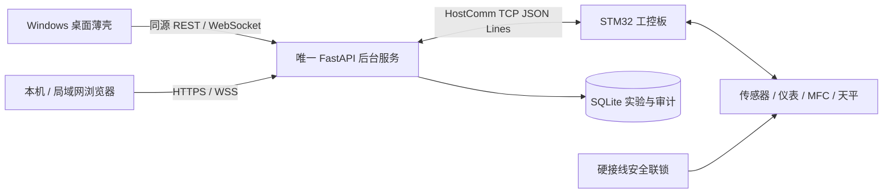

# 系统架构与公共接口

维护角色：软件负责人。已实现部分以 `dev@855c84d` 为核查基线；“目标”条目须按[任务清单](../tasks/todo.md)实现和验收。原 D3 全量规格已[归档](archive/dev-855c84d/docs/上位机软件开发规格说明书.md)，不再重复维护手写数据库 Schema 或不存在的接口。

## 1. 系统职责与数据流



上位机负责用户、控制请求协调、实验归档、参数/配方管理、展示、指标、报告和运维。STM32 负责实时工艺、采集、设备动作、安全处置和设备日志。桌面及页面共用前端和 API；浏览器不直接访问 STM32，关闭桌面不停止采集。

目标模块依赖：API 调用应用服务；应用服务组合通信、实验、操作与数据访问；算法模块接收带质量的数据，不依赖 WebSocket/UI；HostComm 只处理设备协议，不依赖页面或报告。原始数据写入与 UI 推送隔离，慢客户端不能延迟控制回执。

## 2. 当前数据模型与目标增量

数据库现状以 [ORM](../backend/app/db/models.py) 和 [Alembic 迁移](../backend/app/db/migrations/) 为准，不用文档表结构替代迁移。

基线已归档：用户账户及 token_version；实验 test_id、操作者、开始/结束时间、原始料层高度、样品标签、备注；采样与部分质量标志；事件、报警、参数快照、操作审计及报告路径。原始料层高度不会从全局当前参数回填。

待实现的增量：持久化操作状态与稳定操作 ID；完整实验阶段与结束依据；H600 及首滴依据；设备原始时间、接收时间、序号/重启标识；数据完整性；配方/算法/规则版本快照。旧数据缺失保持未知，补录记录操作者、时间、旧值及依据。

报警记录存在确认/解除元数据更新；原始采样和事件不得覆盖。升级失败恢复经验证的备份，不能用逐条删除试验记录作回滚。

## 3. 当前 REST 契约

运行服务生成的 `/openapi.json` 是该构建的 HTTP 类型依据，代码入口见 [API Schema](../backend/app/api/schemas.py) 和 [路由目录](../backend/app/api/routes/)。成功通常封装为 `data` 和 UTC `ts`，业务错误通过 HTTP 状态和 `detail.error_code/message/ts` 返回；输入结构错误也可能使用 FastAPI 的标准 422 错误列表，客户端不能假设所有错误形状相同。

| 接口 | 基线行为与限制 |
|---|---|
| `POST /api/auth/login` | 返回 token、角色、must_change_password 和到期时间；受限用户先改密 |
| `GET /api/status` | 缓存快照、后台状态策略、comm_quality、last_update、data_persistence；不是每次 HTTP 请求直接轮询设备 |
| `POST /api/commands/confirm-intent` | 为 CO 相关命令签发一次性确认令牌，随后随命令提交 |
| `POST /api/commands` | `command`、`params`、可选 `confirm_token`；基线响应不包含持久化操作状态查询能力 |
| `GET /api/parameters` | 读取设备参数；离线可返回 `params: null, comm: offline`，不得解释为零值或默认参数 |
| `PUT /api/parameters` | `values` 对象及可选 `param_crc`；专用服务校验、下发并回读，失败有审计 |
| `GET /api/parameters/history` | 分页参数归档；权限与参数配置一致 |
| `/api/tests`、`/api/trends`、`/api/alarms`、`/api/reports` | 历史、曲线、报警和报告；具体动词、参数及权限以 OpenAPI 为准 |
| `GET /health` / `GET /api/system/health` | 进程存活与应用就绪分别查询；设备离线不能单独否定历史查询能力 |

启动例子（先完成确认令牌流程）：

```json
{
  "command": "start_test",
  "params": {
    "test_id": "ore-20260905-001",
    "original_height_mm": 62.4,
    "sample_label": "样品A",
    "notes": "装样记录见批次原始表"
  },
  "confirm_token": "由本用户确认意图接口取得的一次性令牌"
}
```

基线 `original_height_mm` 必填且范围 `0 < H ≤ 10000 mm`；这是输入边界，不是国标装样合格范围。样品标签不超过 128 字符、备注不超过 1000 字符。实验 ID 由服务统一验证及防重。样品信息属于上位机归档，不因此新增设备字段。

命令角色基线：observer 只读；operator 可受控启停、暂停/恢复、报警确认等；admin/maintainer 可配置参数。角色高低不能替代设备许可。已知缺口是通用 `set_parameters` 绕开专用回读链路、状态字段使用不一致、启动操作尚未统一执行完整后台状态策略，整改见 M2。

## 4. 当前 WebSocket 契约

端点 `/ws/realtime`。连接后第一帧必须是：

```json
{"type":"authenticate","token":"JWT"}
```

认证成功返回 `auth_ok`。客户端随后可发送 `{"type":"ping"}`，服务器校验会话后返回 `pong`。**基线未实现 subscribe/unsubscribe**；其他消息返回 `unsupported_message`，不能依赖旧规格中的订阅示例。JWT 不放在 URL。

推送状态、通信、事件和报警以 [WebSocket 实现](../backend/app/api/websocket.py)、[推送管理器](../backend/app/api/ws_manager.py)及 [应用回调](../backend/app/main.py) 为准。连接有 Origin、消息大小、频率、空闲和每用户连接数限制。WS 已连接只代表浏览器连上后台，控制板连接与数据是否新鲜单独展示。

目标：重连恢复活跃报警与状态快照；带事件序号发现缺口并补查；推送包含明确质量和过期状态。浏览器丢失连接时保留历史显示并标记过期，不能将旧数值继续画作实时数据。

## 5. 目标操作与实验接口

沿用现有 REST 和 WS 入口，渐进增加强类型模型。新增操作资源支持幂等提交、返回操作 ID 和按 ID 查询。内部至少区分待发送、已受理、已完成、已拒绝、失败和结果未知；网络超时不等于设备拒绝或动作撤销。控制请求由后台协调，多个客户端不能各自持有独立设备执行状态。

参数入口和通用命令入口必须复用同一参数服务。状态仅通过一个规范化入口读取 `state_machine.current_state`；旧字段仅在显式兼容规则允许且不冲突时解释，缺失/未知/过期不得放行启动或改参。

实验阶段分别记录命令受理、测定完成、安全处置、冷却完成与归档结束。受理 stop 不等于采集结束；自然终态也必须收尾。重连、后台或板端重启对照设备实验 ID、重启标识及日志恢复；不能确定归属时保留未知和人工对账记录。

配方接口支持 standard/custom、不可变版本、阶段列表、设备能力校验、部署/回读和实际执行版本。具体工艺约束和指标见[实验规范](experiment-spec.md)。设备扩展字段须先完成[契约对齐](待确认事项与接口对齐清单.md)，不在当前 1.0 报文中擅自假定存在。

## 6. 维护和验收

桌面部署及离线事务升级见[发布与维护指南](发布与维护指南.md)。模块完成需包含正向、边界、断线/重启、权限和数据归属测试；关键控制链路需要模拟器与真实固件两层证据。[验证基线](verification.md)分别列出已有防护和仍待整改的缺口。
