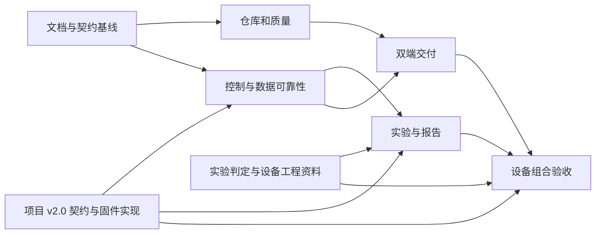

# 全面优化路线图

批准边界：Windows10/11 x64独立桌面安装包、本机和局域网Web、离线可用、人工离线升级；STM32板端执行实时工艺和联锁；标准实验与受限阶段式非标实验。2026-09-06 用户授权项目设计通信契约并作为新固件依据；截至2026-09-20固件开发中、尚未交付验收。保留主线历史和既有标签。审查基线为`dev@855c84d`，不是旧main。

上一候选为 `0.3.0-rc.5`，租约与通信时序修复、陌生运行恢复和独立Windows联调工具已完成软件实现及Windows CI安装版验收，包含实际报告、清理和产物字节核验；证据见[安装版闭环记录](../docs/verification/2026-09-08-installed-hostcomm-loop.md)。候选交付状态、最终提交与字节以对应标签流水线及 Release 附件为准。上一已发布候选rc.4增加安装器诊断及缺失维护准备提示；2026-09-07用户确认提权清理rc.2残留服务后安装成功，覆盖升级/空库/通信未验收。旧1.0离线升级限制及[现场排查历史](../docs/verification/2026-09-06-windows-installer-errors.md)保留；发布检查和产物须绑定本轮提交，不移动既有标签。

## 决策与交付方式

保留Vue/FastAPI/SQLAlchemy/SQLite。每炉单一后台/网关/写入协调器，所有界面复用API。实现工具链Python3.13与Node24；桌面为pywebview、固定WebView2、PyInstaller onedir、NSIS和Windows Service。程序/运行时按版本隔离，ProgramData保存数据，升级用持久事务和完整回滚。依据见[ADR索引](../docs/decisions/README.md)。

需求由[国标映射](../docs/experiment-spec.md)与[架构/接口](../docs/上位机软件开发规格说明书.md)维护；实现进度只在[任务清单](todo.md)更新；证据格式见[验收规范](../docs/verification.md)。不在多份文档复制测试数和“全部完成”的阶段结论。

## 里程碑

| 阶段 | 主要交付物 | 依赖 | 退出条件 | 责任角色 |
|---|---|---|---|---|
| M0 文档基线 | 入口、纠错、国标映射、外部依赖、ADR、计划和待办 | 原PDF/代码审查 | 重要要求有来源；现状/目标/证据可分；本地链接检查通过 | 项目/软件/试验负责人 |
| M1 仓库与质量 | 可恢复bundle、dev祖先整合、UI审查、主线策略、运行时/CI/类型基线 | M0 | 有效改动保留；CI通过；重复分支按证据清理 | 仓库/前端/发布负责人 |
| M2 控制与数据 | 统一状态、参数闭环、操作事务、队列、报警、采集和生命周期恢复 | M0；v2.0 固件/上位机适配；Q2/5/13工程资料 | 控制/断线/超时/重启/过载回归通过；未知结果不误报 | 后端/固件负责人 |
| M3 实验能力 | 装样、H600、国标指标、重复性、标准及非标配方、可追溯报告 | M2；v2.0 配方实现；Q5/8/9/11/12 | 独立人工数据一致；版本化契约一致性测试通过；歧义明确隔离 | 试验/算法/前后端/固件负责人 |
| M4 双端交付 | 桌面薄壳、服务、离线安装、HTTPS、事务升级与全环境回滚 | M1；维护/操作锁依赖M2 | 干净断网Windows双端安装、运行、升级/断电恢复通过 | Windows/发布/现场负责人 |
| M5 设备组合验收 | 冻结接口、联锁、完整实验、24h及恢复验收、指定组合资格证据 | M2—M4；全部相关外部依赖 | 指定软硬件组合完成实测及责任人签字 | 固件/硬件/试验/发布负责人 |

M0后并行开展M1仓库整理、M2控制可靠性和M4打包验证。M3的纯算法可用人工黄金数据并行开发，设备启用必须等待能力/安全契约。阶段有缺口时标明“实现完成待验收”或“外部阻塞”，不得将整个项目标为完成。

## 2026-09-06 rc.2 历史实施位置

M0已合入（PR64）；dev祖先整合（PR48）、PR65软件整合及实际引用清理记录见[最终软件验证](../docs/verification/2026-09-06-software.md#最终集成软件验证)。M1-01—05有界交付及仓库与质量基线退出条件已完成，包括四组Chromium弹窗键盘回归。M2/M3/M4核心已有软件实现；其中设备通信适用 HostComm 1.0 客户端与 Mock。真实 TCP 软件联调不代表固件已开发，也不代表 v2.0 已适配。

该历史阶段的软件检查和Windows CI构建结果以[最终软件验证](../docs/verification/2026-09-06-software.md#最终集成软件验证)为准。后续按外部交付条件推进干净断网Windows安装/服务/实际断电、正式签名、真实固件与完整试验及24h验收；M4现场与M5退出条件仍未满足。

## HostComm v2.0 与新固件

[ADR-008](../docs/decisions/ADR-008-hostcomm-v2-design.md)将新固件协议与现有 1.0 行为分开。项目直接定义报文、状态、身份/租约、持久防重放、定点配方及日志补传；不再将这些软件语义挂在“供应商协议未提供”上。协议设计和可执行向量属于 FW-00，固件、上位机适配与物理验收分别交付。

本次固件交接修订为[2.0-doc.4](../docs/hostcomm/v2/firmware-handoff.md)，以已发布0.3.0为基线，实操入口为[技术交底](../docs/hostcomm/v2/technical-briefing.md)，线上协议/设计号不变。[兼容差异](../docs/hostcomm/v2/compatibility.md)记录主机实现与未验边界；独立SmdBench已通过Windows安装包到TLS模拟器的完整固定流程，结论仅覆盖[本轮验证](../docs/verification/2026-09-08-installed-hostcomm-loop.md)中提交和摘要匹配的构建。纯C核心可并行推进，不把模拟器联调设为C核心开发的硬前置。

详细顺序见[固件与上位机实施路线](../docs/hostcomm/v2/firmware-plan.md)：先做 FW-02 纯 C 协议核心及持久操作故障测试，并行补齐 FW-01 工程 profile；随后连接驱动、安全状态机、配方与日志，再做 FW-09 一致性台架。HOST-2001—2004 已有 rc.3 主机实现和模拟器回归，HOST-2005 的双端/旧库软件验证见[运行记录](../docs/verification/2026-09-06-hostcomm-v2-runtime.md)；台架与现场依赖继续保留。[板卡资料](../docs/hardware/stm32h750vbt6-board.md)已补充 STM32H750VBT6、LAN8720、W25Q128、24C02 和 ADS8688；板卡修订、原理图、复用冲突、实装能力与安全工程资料仍待核实；这些缺项不妨碍纯协议与可注入驱动的主机测试。

工程 profile、物理量程/气体参考状态、标定、联锁时序、真实存储与采样能力仍需 Q2/Q5/Q13 的资料和实测。FW-10 与 M5 记录指定组合的 24h、恢复与完整实验；协议检查通过不能代替这些退出条件。`0.3.0-rc.2` 历史包及历史实验继续按 1.0 标识；`0.3.0-rc.3` 的 2.0 支持范围以运行验证和候选包兼容清单为准。

## 依赖和实施顺序

先完成可复现缺陷和故障路径，再扩展配方/桌面能力。每个任务交付可运行的纵向功能和测试，独立提交；共享数据库变更顺序执行，已发布迁移只追加。发生契约变化先同步类型/迁移/Mock，再集成调用方。

## 发布与维护标准

PR79/81及修复后的主线、标签均完成实际软件与安装版验收；v0.3.0已于2026-09-15发布，非草稿、非预发布。21项实际发行资产与机器证据核验已通过，OVER-01—07的软件发行范围完成，见[本轮记录](../docs/verification/2026-09-13-overwrite-install.md#标签构建与正式发布)。历史失败和预算阻塞保留，人工Windows、签名及M5仍按各自证据推进，不从软件版本号推断设备验收。

本轮已发布 `0.3.0` 软件正式版，按[ADR-011](../docs/decisions/ADR-011-overwrite-install-and-software-release.md)将软件发布与设备组合验收分开。保留既有 `0.3.0-rc.N` 标签和资产；必要检查、真实 Windows 安装升级与 SmdBench 通过后合入主线，标签流水线对该提交重新构建、验收，并按[机器证据契约](../docs/release-acceptance.md)核验实际产物后发布。缺少场景、日志或实际字节不发布。Win10/11 桌面和 M5 未验收范围在发行说明中列出，不使用软件正式版标志替代其证据。每次交付仍记录数据库、协议、固件、硬件与运行时兼容范围，以及组件、摘要和恢复说明。

软件/模拟器/Windows/真机四层分别验收。持续运行至少24h、按冻结最高采样率；窗口关闭不丢采集，设备离线不妨碍历史查询，控制状态未知时不放行新的有副作用请求。日常维护关注数据完整性、备份恢复、队列/磁盘及离线运行时更新。

## 外部依赖与默认处理

[Q1—Q15](../docs/待确认事项与接口对齐清单.md)区分项目设计、双方实现与工程证据。Q1/Q3/Q4/Q7/Q10/Q15 的软件语义由项目设计并推进实现；物理故障映射、参数范围和目标板验证仍需工程依据。未提供真实 Windows、STM32、电气图或标准歧义确认时，继续完成内部软件与模拟测试，对应硬件/符合性验收保持未完成。不能以 Mock 字段或协议设计代替真实固件支持，也不能把算法默认口径写成国标原文。

## 2026-09-07 安装版实验闭环实施

批准基线 `main@89e5ec1` / `0.3.0-rc.4`；本轮按[ADR-010](../docs/decisions/ADR-010-installed-hostcomm-loop.md)推进rc.5。P1—P4及HOST-2006—2009的软件范围已完成，Windows CI安装版固定流程、实际报告、归属清理及严格封装均通过，见[本轮验证](../docs/verification/2026-09-08-installed-hostcomm-loop.md)。P5作为每次候选交付的必要规则执行：标签重新运行共享检查、安装版验收及产物字节校验，不复用不同构建的通过结论。

| 顺序 | 任务 | 依赖 | 退出条件 |
|---|---|---|---|
| P1 | HOST-2007/2008 租约与通信时序 | 契约2.0/design.1 | 期限、迟到回执、并发释放/停止、重连回归通过 |
| P2 | 独立SmdBench基础，可与P1并行 | 当前TLS模拟器 | 无额外开发环境；全新归属安装；私有动作管道 |
| P3 | HOST-2006 未绑定运行恢复 | 源记录/写入协调器 | 审查绑定、回放恢复、缺失资料与终态门禁通过 |
| P4 | HOST-2009 页面至报告及故障流程 | P1—P3 | 安装版TLS/HTTP/页面/实际导出一致，证据脱敏 |
| P5 | CI与RC交付 | P4与必要质量检查 | 每次标签重新验收同SHA安装器、独立工具、实际字节和未验收清单 |

CI先保留原安装冒烟检查，再由独立工具建立并清理自己的安装，避免两套入口交接权限。Win10/11桌面人工验收与FW-02纯C核心可并行推进，前者不是本轮RC发布的硬前置，二者均不是CI通过即可关闭的任务。

## 2026-09-13 覆盖安装与软件正式版实施

批准边界：用户直接运行安装器，保留当前配置和数据库；不再填写目标版本或先登录旧版准备维护。已知实验/冷却活动拒绝；已配对但离线或状态未知时，由 Windows 管理员在安装器确认现场已安全停机。未完成档案和未知命令不能因更新而自动结束。目标为软件正式版 `0.3.0`，硬件/联锁/国标符合性和 Win10/11 人工验收各自保留未验证状态。

| 顺序 | 任务 / 依赖 | 交付和退出条件 | 责任角色 |
|---|---|---|---|
| O1 | OVER-01/02；现有维护和命令锁 | 安装器本机授权、旧版本兼容、移除页面手填流程；并发/离线/忙碌回归通过 | Windows/后端/前端负责人 |
| O2 | OVER-03/04；O1 | 单次暂存、空间估算、保留数据、同版修复、可续跑恢复；失败注入通过 | Windows/后端负责人 |
| O3 | OVER-05；O1/O2 | 真实 rc.4/rc.5 数据升级、故障恢复、账户与配置、路径/版本拒绝有 Windows CI 证据；SmdBench 继续通过 | Windows/测试负责人 |
| O4 | OVER-06/07；O3和全部必要检查 | 同提交实际包与日志验收、更新文档和限制、不可移动 `v0.3.0` 与软件正式版资产 | 发布/维护负责人 |

旧 `rollback_failed` 由新安装器保全当前状态后处理；用户尚未返回原恢复命令结果，不预设该事务已经恢复。首次稳定交付不自动清理数据库或配置备份。实现进度在[任务清单](todo.md)维护，本表不是通过记录。

## 2026-09-20 STM32H750 技术交底与离线资料

DOC-FW-03 交付[技术交底主文档](../docs/hostcomm/v2/technical-briefing.md)、doc.4导航/版本同步及轻量离线资料包，协议2.0和握手2.0-design.1不变。主文档按板卡准备、离线配对、26种消息、实验和故障恢复、验收与交底记录组织；未知工程值和具名责任人由双方回填，不用示例代替批准配置。

离线包从文档PR最终提交的受版本控制源码快照生成，保留相对目录和附图；包内登记完整SHA、版本映射及文件摘要，包外提供ZIP摘要。产物在仓库外生成，不提交二进制包，不携带Git历史、开发环境、现场配置或凭据。退出条件是文档/契约/JavaScript向量检查、独立核对和解包完整性验证通过，PR保持开放供审阅；不修改应用、Schema、数据库或既有发行资产。

用户已确认0.3.0安装成功，固件开发中、尚未交付验收。文档交底关闭不代表FW-01—10或M5通过；下一步由固件负责人回填当前模块进度和构建材料，按FW-02/03/04取得C端及H750通信证据，再进入真实执行器联调。
