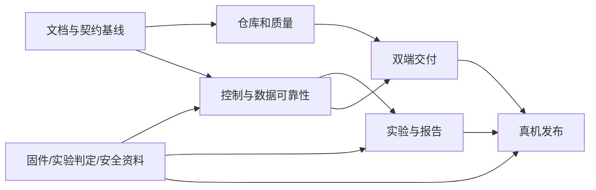

# 全面优化路线图

批准边界：Windows10/11 x64独立桌面安装包、本机和局域网Web、离线可用、人工离线升级；STM32固件协同修改，板端执行实时工艺和联锁；标准实验与受限阶段式非标实验。保留主线历史和既有标签。审查基线为`dev@855c84d`，不是旧main。

## 决策与交付方式

保留Vue/FastAPI/SQLAlchemy/SQLite。每炉单一后台/网关/写入协调器，所有界面复用API。目标Python3.13与Node24；桌面为pywebview、固定WebView2、PyInstaller onedir、NSIS和Windows Service。程序/运行时按版本隔离，ProgramData保存数据，升级用持久事务和完整回滚。依据见[ADR索引](../docs/decisions/README.md)。

需求由[国标映射](../docs/experiment-spec.md)与[架构/接口](../docs/上位机软件开发规格说明书.md)维护；实现进度只在[任务清单](todo.md)更新；证据格式见[验收规范](../docs/verification.md)。不在多份文档复制测试数和“全部完成”的阶段结论。

## 里程碑

| 阶段 | 主要交付物 | 依赖 | 退出条件 | 责任角色 |
|---|---|---|---|---|
| M0 文档基线 | 入口、纠错、国标映射、外部依赖、ADR、计划和待办 | 原PDF/代码审查 | 重要要求有来源；现状/目标/证据可分；本地链接检查通过 | 项目/软件/试验负责人 |
| M1 仓库与质量 | 可恢复bundle、dev祖先整合、UI审查、主线策略、运行时/CI/类型基线 | M0 | 有效改动保留；CI通过；重复分支按证据清理 | 仓库/前端/发布负责人 |
| M2 控制与数据 | 统一状态、参数闭环、操作事务、队列、报警、采集和生命周期恢复 | M0；契约项Q1—7/Q10 | 控制/断线/超时/重启/过载回归通过；未知结果不误报 | 后端/固件负责人 |
| M3 实验能力 | 装样、H600、国标指标、重复性、标准及非标配方、可追溯报告 | M2；Q4/5/8/9/11/12/15 | 独立人工数据一致；已冻结契约模拟器通过；歧义明确隔离 | 试验/算法/前后端/固件负责人 |
| M4 双端交付 | 桌面薄壳、服务、离线安装、HTTPS、事务升级与全环境回滚 | M1；维护/操作锁依赖M2 | 干净断网Windows双端安装、运行、升级/断电恢复通过 | Windows/发布/现场负责人 |
| M5 真机发布 | 冻结接口、联锁、完整实验、24h及恢复验收、正式发布证据 | M2—M4；全部相关外部依赖 | 指定软硬件组合完成实测及责任人签字 | 固件/硬件/试验/发布负责人 |

M0后并行开展M1仓库整理、M2控制可靠性和M4打包验证。M3的纯算法可用人工黄金数据并行开发，设备启用必须等待能力/安全契约。阶段有缺口时标明“实现完成待验收”或“外部阻塞”，不得将整个项目标为完成。

## 依赖和实施顺序

先完成可复现缺陷和故障路径，再扩展配方/桌面能力。每个任务交付可运行的纵向功能和测试，独立提交；共享数据库变更顺序执行，已发布迁移只追加。发生契约变化先同步类型/迁移/Mock，再集成调用方。

## 发布与维护标准

沿用0.3.0候选序列，正式版前使用RC并列出未验证项。PR/tag共用必要检查；版本、包清单、tag与提交一致。每次发布记录数据库、协议、固件、硬件与运行时兼容组合；离线包包含组件清单、hash、来源验证和恢复说明。

软件/模拟器/Windows/真机四层分别验收。持续运行至少24h、按冻结最高采样率；窗口关闭不丢采集，设备离线不妨碍历史查询，控制状态未知时不放行新的有副作用请求。日常维护关注数据完整性、备份恢复、队列/磁盘及离线运行时更新。

## 外部依赖与默认处理

[Q1—Q15](../docs/待确认事项与接口对齐清单.md)定义交付者和关闭依据。未提供真实Windows、STM32、电气图或标准歧义确认时，继续完成内部软件与模拟测试；对应硬件/符合性验收保持未完成。不能在Mock中增添字段后反向宣布固件契约已冻结，也不能把算法默认口径写成国标原文。
