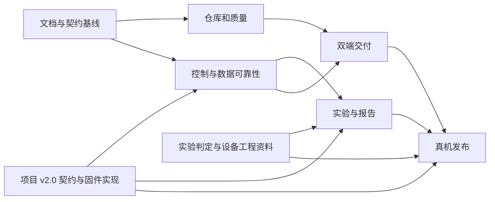

# 全面优化路线图

批准边界：Windows10/11 x64独立桌面安装包、本机和局域网Web、离线可用、人工离线升级；STM32板端执行实时工艺和联锁；标准实验与受限阶段式非标实验。2026-09-06 用户确认固件尚未开发，授权项目设计通信契约并作为新固件依据。保留主线历史和既有标签。审查基线为`dev@855c84d`，不是旧main。

## 决策与交付方式

保留Vue/FastAPI/SQLAlchemy/SQLite。每炉单一后台/网关/写入协调器，所有界面复用API。实现工具链Python3.13与Node24；桌面为pywebview、固定WebView2、PyInstaller onedir、NSIS和Windows Service。程序/运行时按版本隔离，ProgramData保存数据，升级用持久事务和完整回滚。依据见[ADR索引](../docs/decisions/README.md)。

需求由[国标映射](../docs/experiment-spec.md)与[架构/接口](../docs/上位机软件开发规格说明书.md)维护；实现进度只在[任务清单](todo.md)更新；证据格式见[验收规范](../docs/verification.md)。不在多份文档复制测试数和“全部完成”的阶段结论。

## 里程碑

| 阶段 | 主要交付物 | 依赖 | 退出条件 | 责任角色 |
|---|---|---|---|---|
| M0 文档基线 | 入口、纠错、国标映射、外部依赖、ADR、计划和待办 | 原PDF/代码审查 | 重要要求有来源；现状/目标/证据可分；本地链接检查通过 | 项目/软件/试验负责人 |
| M1 仓库与质量 | 可恢复bundle、dev祖先整合、UI审查、主线策略、运行时/CI/类型基线 | M0 | 有效改动保留；CI通过；重复分支按证据清理 | 仓库/前端/发布负责人 |
| M2 控制与数据 | 统一状态、参数闭环、操作事务、队列、报警、采集和生命周期恢复 | M0；v2.0 固件/上位机适配；Q2/5/13工程资料 | 控制/断线/超时/重启/过载回归通过；未知结果不误报 | 后端/固件负责人 |
| M3 实验能力 | 装样、H600、国标指标、重复性、标准及非标配方、可追溯报告 | M2；v2.0 配方实现；Q5/8/9/11/12 | 独立人工数据一致；版本化契约一致性测试通过；歧义明确隔离 | 试验/算法/前后端/固件负责人 |
| M4 双端交付 | 桌面薄壳、服务、离线安装、HTTPS、事务升级与全环境回滚 | M1；维护/操作锁依赖M2 | 干净断网Windows双端安装、运行、升级/断电恢复通过 | Windows/发布/现场负责人 |
| M5 真机发布 | 冻结接口、联锁、完整实验、24h及恢复验收、正式发布证据 | M2—M4；全部相关外部依赖 | 指定软硬件组合完成实测及责任人签字 | 固件/硬件/试验/发布负责人 |

M0后并行开展M1仓库整理、M2控制可靠性和M4打包验证。M3的纯算法可用人工黄金数据并行开发，设备启用必须等待能力/安全契约。阶段有缺口时标明“实现完成待验收”或“外部阻塞”，不得将整个项目标为完成。

## 2026-09-06 实施位置

M0已合入（PR64）；dev祖先整合（PR48）、PR65软件整合及实际引用清理记录见[最终软件验证](../docs/verification/2026-09-06-software.md#最终集成软件验证)。M1-01—05有界交付及仓库与质量基线退出条件已完成，包括四组Chromium弹窗键盘回归。M2/M3/M4核心已有软件实现；其中设备通信适用 HostComm 1.0 客户端与 Mock。真实 TCP 软件联调不代表固件已开发，也不代表 v2.0 已适配。

最终软件检查和Windows CI构建结果以[最终软件验证](../docs/verification/2026-09-06-software.md#最终集成软件验证)为准。后续按外部交付条件推进干净断网Windows安装/服务/实际断电、正式签名、真实固件与完整试验及24h验收；M4现场与M5退出条件仍未满足。

## HostComm v2.0 与新固件

[ADR-008](../docs/decisions/ADR-008-hostcomm-v2-design.md)将新固件协议与现有 1.0 行为分开。项目直接定义报文、状态、身份/租约、持久防重放、定点配方及日志补传；不再将这些软件语义挂在“供应商协议未提供”上。协议设计和可执行向量属于 FW-00，固件、上位机适配与物理验收分别交付。

详细顺序见[固件与上位机实施路线](../docs/hostcomm/v2/firmware-plan.md)：先做 FW-02 纯 C 协议核心及持久操作故障测试，并行补齐 FW-01 工程 profile；随后连接驱动、安全状态机、配方与日志，再做 FW-09 一致性台架。HOST-2001—2004 根据同一契约实现后台适配，HOST-2005 验证桌面/Web 与旧数据库升级。[板卡资料](../docs/hardware/stm32h750vbt6-board.md)已补充 STM32H750VBT6、LAN8720、W25Q128、24C02 和 ADS8688；板卡修订、原理图、复用冲突、实装能力与安全工程资料仍待核实；这些缺项不妨碍纯协议与可注入驱动的主机测试。

工程 profile、物理量程/气体参考状态、标定、联锁时序、真实存储与采样能力仍需 Q2/Q5/Q13 的资料和实测。FW-10 与 M5 记录指定组合的 24h、恢复与完整实验；协议检查通过不能代替这些退出条件。现有 `0.3.0-rc.2` 包及历史实验继续按 1.0 标识，完成适配前不宣称支持 v2.0。

## 依赖和实施顺序

先完成可复现缺陷和故障路径，再扩展配方/桌面能力。每个任务交付可运行的纵向功能和测试，独立提交；共享数据库变更顺序执行，已发布迁移只追加。发生契约变化先同步类型/迁移/Mock，再集成调用方。

## 发布与维护标准

沿用0.3.0候选序列，本轮推进到0.3.0-rc.2用于识别新旧版本，不创建发布标签；正式版前使用RC并列出未验证项。PR/tag共用必要检查；版本、包清单、tag与提交一致。每次发布记录数据库、协议、固件、硬件与运行时兼容组合；离线包包含组件清单、hash、来源验证和恢复说明。

软件/模拟器/Windows/真机四层分别验收。持续运行至少24h、按冻结最高采样率；窗口关闭不丢采集，设备离线不妨碍历史查询，控制状态未知时不放行新的有副作用请求。日常维护关注数据完整性、备份恢复、队列/磁盘及离线运行时更新。

## 外部依赖与默认处理

[Q1—Q15](../docs/待确认事项与接口对齐清单.md)区分项目设计、双方实现与工程证据。Q1/Q3/Q4/Q7/Q10/Q15 的软件语义由项目设计并推进实现；物理故障映射、参数范围和目标板验证仍需工程依据。未提供真实 Windows、STM32、电气图或标准歧义确认时，继续完成内部软件与模拟测试，对应硬件/符合性验收保持未完成。不能以 Mock 字段或协议设计代替真实固件支持，也不能把算法默认口径写成国标原文。
